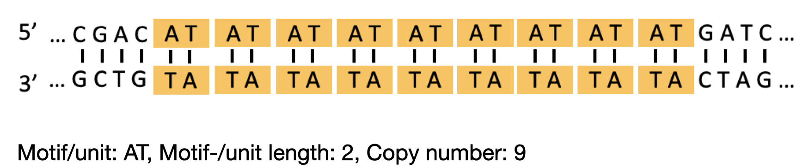
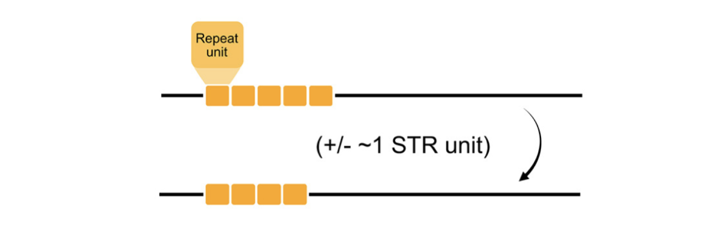

# BIO392 - WebSTR API Exercise

In this exercise, your goal is to identify the STR locus with the highest number of unique allele lengths across samples from the 1000 Genomes Project.

### Import STRs 

The database [WebSTR](https://webstr.ucsd.edu/) provides programmatic access to the data using a RESTful API, documentation on endpoints is available on the main page: https://webstr-api.lsfm.zhaw.ch/docs. Use the following code to retrieve STRs near the **APC** gene:

```python
import requests 
import pandas as pd

resp = requests.get('https://webstr-api.lsfm.zhaw.ch/repeats/?gene_names=APC'
df_repeats = pd.DataFrame.from_records(resp.json())
```
This will return STRs from both panels `ensembleTR` and `gangstr_crc_hg38`. 

### Filter STRs

- Panel selection: Choose the panel relevant to your analysis.
- Repeat unit size: Keep only STRs with period = 1, as these are generally more polymorphic.

### Retrieve Allele Frequencies

For the filtered STRs, use the following endpoint to retrieve allele frequencies:
```
https://webstr-api.lsfm.zhaw.ch/allfreqs/
```
### Find the Most Polymorphic STR

- Count the number of unique allele lengths for each STR.
- Identify the STR locus with the highest number of alleles.
- Report the following information for this STR locus: Chromosome, start, end positions

### Visualize Allele Frequencies

- Create a bar plot to visualize the allele frequency distribution:
- Go to [WebSTR](https://webstr.ucsd.edu/), search using the chromosome and coordinates of the STR locus you found and check if the allele frequency distribution matches what you retrieved via the API

# BIO392 - STR variant calling

## Part 1: analysis

**Author: Max Verbiest, max.verbiest@zhaw.ch**

Practical for the course "Bioinformatics of Sequence Variation". This project aims to introduce a standard bioinformatics pipeline, which includes short-read sequence alignment, variant calling, and variant interpretation. Specifically, the aim will be to identify short tandem repeat (STR) variants from sequencing data, and to interpret their effects. 

You will be provided with (simulated) sequencing data from three tumours. Given these samples, your task is to align them to a reference genome, process the alignment, and look for genetic variants. Finally, you will need to investigate the possible functional effects of any detected variant to see if they could be relevant in the context of cancer.

*Note: to keep this process managable, we will focus on only a single gene: the APC gene. The reference sequence can be found in `data/reference/`. The sequencing reads that you'll be using from this project were simulated from the APC reference sequence using [wgsim](https://github.com/lh3/wgsim).*


## Background  

Short tandem repeats (STRs) are consecutive repetitions of 1-6 basepair (bp) motifs. They are estimated to make up around 3% of the human genome. Below is an example STR locus:  

  

STRs are a rich source of genomic variation, with some loci having mutation rates up to a 10'000 times higher than point mutations. STR mutations are typically the result of DNA polymerase slippage during replication, where strand misalignment after polymerase detachment results in the insertion or deletion of one or more repeat units at an STR locus:  



The role that STR mutations play in cancer is an area of active investigation. For more background on STRs, the way they mutate, and why they are relevant, you can have a look at this [review](https://onlinelibrary.wiley.com/doi/full/10.1111/jeb.14106). Reading the Abstract & Introduction sections provide an overview of our current knowledge of STRs. The later sections are more of a deep-dive into specific STR characteristics.

## Setting up  

To get started, download the `project-day-07.zip` archive from the course GitHub. Save it to a directory of your choice, and unzip it. Navigate to the `project-day-07` folder in a terminal and set up the conda environment as follows:  

```sh
conda env create -f environment.yaml
```

Once all the dependencies are installed, activate the environment like this:  

```sh
conda activate BIO392-practical
```

As long as you keep working in this environment, you will have all the tools available to complete this practical!

## Inspecting read quality

Before doing starting any bioinformatics analysis of sequencing data, it's a good idea to inspect the sequencing reads. This allows you to get a feel for their quality, and to identify potential issues with the data early on. One handy tool that you can use for this is called FastQC, and is installed in your conda environment.

In your terminal, run:
```sh
fastqc
```
This will open the fastq program. Click on `File`, `Open...` and open all the sequencing reads located in the `data/reads` folder (you can select all six files at once). Take a moment to look through the different types of statistics that FastQC gives for each file. Compare the `Per base sequence quality` graph that you get from FastQC to the example shown in the slides. **Answer Q1 and Q2.**

## Short read alignment and processing

Navigate to the folder `project-day-07/scripts/` in your terminal. Here, you will find several numbered bash scripts to run the bioinformatics workflow for this project. The first script `00_index_reference.sh` will generate several indices of the reference genome, which we will need to efficiently perform downstream analyses such as alignment and variant calling. Run the script from your terminal: `./00_index_reference.sh`, confirm that index files appear next to the reference sequence in `data/reference`, and **answer Q3**.

**Important: make sure you are in the `scripts/` directory when running the scripts, otherwise they will not work properly**

The first script (`01_alignment.sh`) maps the sequencing reads to the *APC* reference sequence. Run this script and confirm that three `.sam` files are generated under `data/alignments`. Next, run the script `02_process_alignments.sh`. Confirm that for each `.sam` file, there is now also a `.bam` and a `.bam.bai` file. Open the scripts themselves as well in a text editor: look at the different steps it performs and read the comments. **Answer Q4.**

## STR genotyping using GangSTR

Inspect the file `03_run_gangstr.sh`. This script will launch GangSTR - and STR genotyping tool - and deposit the output files in the `results` folder. GangSTR needs to know about several files in order to call STR genotypes, which is what the different command line arguments that you see in the script are for. Make sure you understand what each of these files are and **answer Q5**. 

You can get more information on GangSTR by checking the documentation in [the GangSTR Github repo](https://github.com/gymreklab/gangstr). Additionally, you can get usage information by running the following in your terminal: 

```sh
GangSTR --help
```

Once you understand the information GangSTR needs and why, run the script `03_run_gangstr.sh`. This should generate three output files per sample: one with extension `.vcf.gz`, one with `samplestats.tab`, and one with `insdata.tab`.

## Combining VCF files
The final script for today is `04_process_vcfs.sh`. Open it up to see what it does, then run it. This should generate the results that we will analyse in the "BIO392 - Sequence analysis: interpretation" session. If you have time to spare, browse the `merged_results.vcf` file in a text editor and try to figure out what it contains (don't worry if you don't manage, you will have more time for this in a later session). 
*Hint: look at the [VCF format specification](https://samtools.github.io/hts-specs/VCFv4.4.pdf)*

**--END OF PART 1--**
