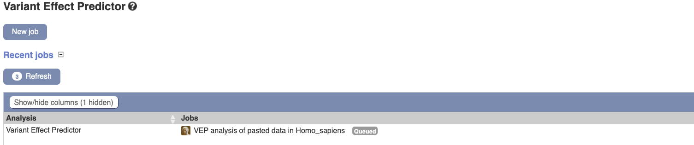

# BIO392 - Sequence analysis: practical
# Part 2: interpretation

**Author: Max Verbiest, max.verbiest@zhaw.ch**

Practical for the course "Bioinformatics of Sequence Variation". This project aims to introduce a standard bioinformatics pipeline, which includes short-read sequence alignment, variant calling, and variant interpretation. Specifically, the aim will be to identify short tandem repeat (STR) variants from sequencing data, and to interpret their effects. 

In the last session we went through a general bioinformatics pipeline that generated variant call files (VCF) describing our sequencing data. Today, we will learn more about VCF files and how to work with them programatically to detect STR variants. Subsequently, we will try to interpret the possible effects of any mutations we find using the integrative genomics viewer (IGV) web app and Ensembl's variant effect predictor (VEP) tool. There is also a new markdown file with questions: `questions-day-09.md`.

## Understanding VCF
The bioinformatics pipeline generated two output files in the `results` folder: `merged_results.vcf` and `merged_results_summary.tsv`. The summary file was generated from the VCF file by bcftools and contains a subset of information. Open both files in a text editor and browse their contents. Also take some time to look at the [VCF format specification](https://samtools.github.io/hts-specs/VCFv4.4.pdf). Please don't read the whole thing! It should suffice to read the the first few paragraphs and section "1.6.1 Fixed fields". Once you know what the columns CHROM, POS, REF, and ALT mean, you are ready to proceed and **answer Q1 and Q2.**

## Identifying STR variants
Now that you have some understanding of the VCF format, you will parse the results files and identify STR loci for which one or more patient(s) have a variant in their genome. You will this using a jupyter notebook. To start the notebook, run the following from the `project-day-07` directory:

```sh
jupyter notebook notebooks/identifying-variants-day-10.ipynb
```

This should open the notebook in your browser. Work through it and return here once you've identified the STR variant(s).

## Inspecting STR variants in the IGV web app
Open the [IGV web app](https://igv.org/app/) in your browser of choice. For now, it just look like this:


By default, the human reference genome 'GRCh38' is loaded in the viewer. However, we want to use our custom APC reference sequence. Click on the `Genome` button in the top left, and select `Local File...`. You will then be prompted to select a file to upload. Navigate to the `data/reference/` folder, select `APC.fa` AND `APC.fa.fai` at the same time, and press `Open`, like so: 


The IGV web app should now display the reference sequence. You can even inspect the sequence at the nucleotide level if you zoom in a bit, although this is not very interesting by itself:


Let's add some of the other information we have available! Press the `Tracks` button at the top, choose `Local File...` again, and upload the `merged_results.vcf` VCF file generated by bcftools (this file does not need an index). Next, upload the two files in `data/genome_annotation` at the same time (the files ending in `.gtf.gz` and `.gtf.gz.tbi`). This pair of files is are a GTF file and it's index. GTF is a file format for annotation genomic sequences. This particular GTF file tells us where the transcript, exons, and coding sequences of the APC gene are located. Finally, we can add our alignment files to the genome viewer. Add them via `Tracks`, `Local File...` and just select all three alignments (`.bam`) and their associated indexes (`.bam.bai`) at the same time (so six files in total). After uploading all information, the final result should look something like what is shown below (once you zoom in a bit). Take a moment to look at the different tracks, **answer Q3**.


## Interpreting an STR variant's impact

So we've identified STR variants in our sequencing samples, how do we interpret these? Luckily for us, Ensembl has a tool called the [Variant Effect Predictor](https://www.ensembl.org/Tools/VEP). It allows us to upload our identified variants, and the tool will compare it to other resources to predict whether there is a functional impact for our variant.

You can now paste the first 5 columns of the STR variants from your VCF file into the `Input data` field of the VEP tool. However, we first need to modify the VCF entries a bit: First, because we used only the APC gene sequence in our analysis, the genomic coordinates in our VCF file do not reflect the true coordinates in the humsn reference genome (which is what VEP uses). The APC sequence I extracted for this project starts at chromosome 5, position 112702498. Therefore, to convert from our coordinate system to GRCh38 coordinates, we just need to add 112702498. Additionally, VEP expects chromosome identifiers just as a number, not prefixed with `chr`, as we currently have them.

So, if this is a VCF entry for an STR variant you identified:

```
chr5	89325	.	ctgctgctgctgctg	ctgctgctg
```

You should modify it to look like this:

```
5	112791823	.	ctgctgctgctgctg	ctgctgctg
```

Once your variant is in the correct format, paste it into the `Input data` field, and press `Run >` at the bottom of the page. After a moment, you will be taken to this page:



Once your job status changes from `Queued` to `Done`, click `[View results]` to explore what information VEP found for the STR variants. Take some time to explore the output, and follow the links VEP provides to get additional information on STR variants. **Answer Q4 and Q5.**

**--END OF PART 2--**
