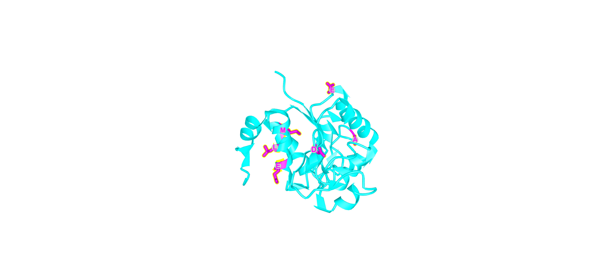
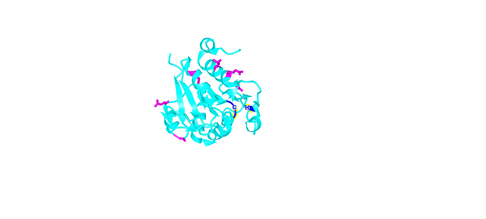

# Activity 5 (NCBI resources)
Daria & Jonas 03.10.2019

## 1) Which	chromosome	is	it	located	on?	
DJ-1 is encoded by the PARK7 gene which is located on chromosome 1 **(Chr1: 7,961,654 -7,985,282)** from _(GRCh38.p12)_

* _It differs from the Ensembl location which is Chr1: 7,954,291-7,985,505. The reason for this is most likely that Ensembl used GRCh38.p13_

## 2) What	information	is	contained	in	dbVar?	
dbVar is a database of **human genomic structural variation** from NCBI.
contains informations about insertions, deletions, duplications, inversions, mobile elements, translocations. So general for large changes.

* _if the Location was the input source we obtained 197 items in dbVar._
* _if the Gene names was the input source we obtained 202 items._
* _if the Location overlaps there also can be other genes than DJ-1_ 

## 3) What	information	is	in	dbSNP?
dbSNP is a database from NCBI that contains human single nucleotide variations, microsatellites, small-scale insertions and deletions (with publication), 
population frequency, molecular consequence, genomic and RefSeq mapping information for  common variations and clinical mutations.

* _if the Location was the input source we obtained 6114 items in dbSNP._
* _if the Gene name was the input source we obtained 7286 items._

Table for filter by dbVar & sbSNP contains: Variant ID, Location, Variant type, Gene, Molecular consequences, Most severe clinical significance, 1000G MAF, GO-ESP MAF, ExAC MAF and the Publications.

## 4) What	information	is	in	ClinVar?
ClinVar has informations about the relationship of genomic variations and human health

* _if the Location was the input source we obtained 99 items in the Yes section and 7389 No section_
* _if the Gene name was the input source we obtained 99 items in the Yes section and 6212 No section_

For "Most severe clinica signlificance" we obtained in both 71 pathogenic and 3 likely-pathogenic. 
Other numbers for "Moleculare consequence"

## 5) How	many	variants	do	you	have?
By filtering for dbSNP misssense pathogenic (6). 
PDB ID was not provided on the site. We looked for them manualy on PDB.

| Variant ID | Mutation | Mutation type | PDB ID |Location in protein (active site 106 & 126)| Polyphen 2 score | Prediction about impact?|
| ------------- |:-------------:|:-------------:|:-------------:|:-------------:|:-------------:|-----:|
| rs74315351 | Met26Ile | Bothe are non-polar (hydrophobic) but Met has Sulfid (cant make bond) | 2RK4 | in alpha helix | 0.007| BENIGN |
|	rs137853051 | Ala39Ser | Non-polar (hydrophobic) --> polar (hydrophilic) |x| in a turn | 0.000 | BENIGN |
| rs74315353| Glu64Asp | bothe (-) charge (acidic) |x| loop | 0.000 | BENIGN |
|	rs74315352| Asp149Ala |(-) charged (acidic) --> nonpolar (hydrophobic) |x| in a beta strand | 0.992 |Probably Damaging |
| rs74315354| Glu163Lys | (-) charged (acidic) --> (+) charged (basic)|2RK6 and(3B3A +other mut | in alpha helix | 0.389 | Probably Damaging|
|	rs28938172| Leu166Pro | Non-polar (hydrophobic) but Proline aromatic |x | in alpha helix | 1.000 | Probably Damaging |

## 6) Generated Images via  iCn3D from PDB ID 1Q2U

* _Image1: DJ1 as homodimer_

* _Image2: Mutations in purple_

* _Image3: Mutations in purple_

* _Image3: Mutations in purple and active site_

**Further information about mutations:**
**Met26Iil**: M26I mutation does not appear to adversely affect either protein stability, turnover by the proteasome, or the capacity of DJ-1 to form homooligomers.But it is possible to have an influence on other fundamental property of DJ-1, such as enzymatic activity or protein–protein interactions. Mutations (A104T, E163K, and **M26I**) reduce the thermal stability of DJ-1 in solution. M26I is located in the hydrophobic core of the protein_(Lakshminarasimhan et al, 2011)_. Study showed homozygous missense mutation in exon 2, (M26I) in an Ashkenazi Jewish patient with young-onset Parkinson’sdisease (Abou-Sleiman, Healy, Quinn, Lees, & Wood, 2003).

**Glu64Asp**: The E64D mutation does not alter the structure of the DJ1 protein. alpha-helices were more susceptible to thermal denaturation than the beta-sheet, and [WT]DJ-1 was more flexible in this regard than [E64D]DJ-1. Thus, structural defects of [E64D]DJ-1 only become apparent upon denaturing conditions, whereas the L166P mutation causes a drastic defect that leads to excessive degradation.(Görner et al., 2004)

**Asp149Ala**: D149A, indicating secondary structural changes. DJ-1 Ala-104 and Asp-149 are completely conserved residues between a broad spectrum ofspecies, highlighting a potentially important structure-function relationship.(Björkblom et al., 2013)

**Leu166Pro**:Strongly decreases enzymatic activity; reduces protein stability and leads to increased degradation; ubiquitinated by PRKN leading to its recognition by HDAC6 and targeting to aggresome where is degraded; interferes with homodimerization; abolishes interaction with PIAS2; reduced localization in lipid rafts (uniprot.org). This seems to be the most important mutation for us!

**References:**

Mahadevan Lakshminarasimhan+,†, Marien T. Maldonado+,†, Wenbo Zhou#, Anthony L. Fink#,  and M. A. W. (2011). Structural Impact of Three Parkinsonism-Associated Missense Mutations on Human DJ-1. Bone, 23(1), 1–7. 

Abou-Sleiman, P. M., Healy, D. G., Quinn, N., Lees, A. J., & Wood, N. W. (2003). The role of pathogenic DJ-1 mutations in Parkinson’s disease. Annals of Neurology, 54(3), 283–286. https://doi.org/10.1002/ana.10675

Görner, K., Holtorf, E., Odoy, S., Nuscher, B., Yamamoto, A., Regula, J. T., … Kahle, P. J. (2004). Differential Effects of Parkinson’s Disease-associated Mutations on Stability and Folding of DJ-1. Journal of Biological Chemistry, 279(8), 6943–6951. 

Björkblom, B., Adilbayeva, A., Maple-Grødem, J., Piston, D., Ökvist, M., Xu, X. M., … Møller, S. G. (2013). Parkinson disease protein DJ-1 binds metals and protects against metal-induced cytotoxicity. Journal of Biological Chemistry, 288(31), 22809–22820. 
