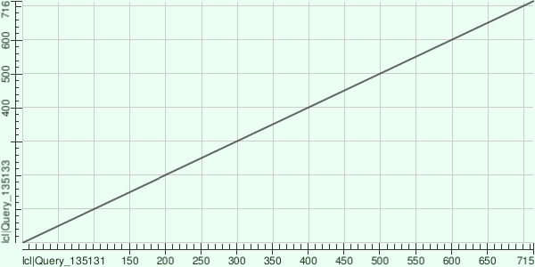
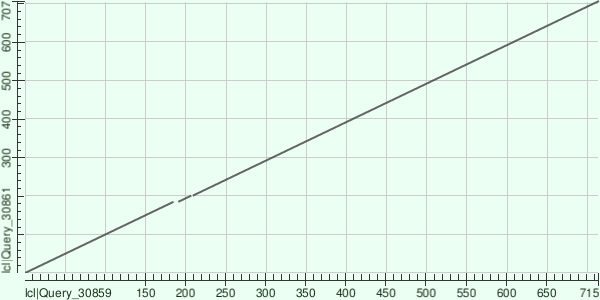
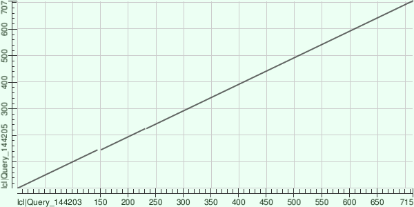
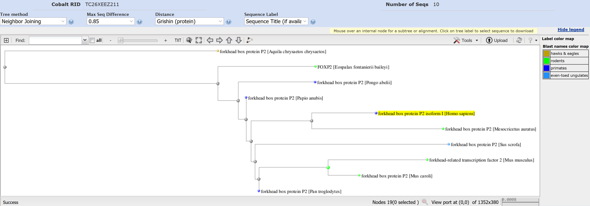
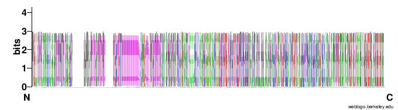
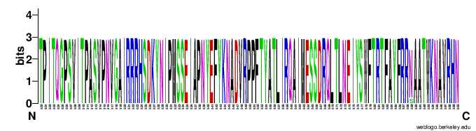
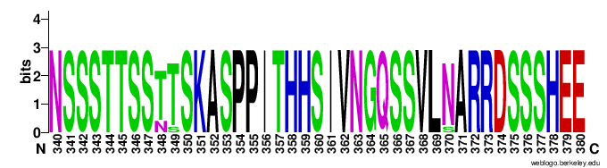

# Activity 6 (FOXP2 – class work) 
Daria & Jonas 04.10.2019

## 1. Which biological process does it participate in? Which reaction does it catalyse?
The Uniprot ID of this protein  **O15409**
* transcriptional repressor that may have an role in the specification and differentiation in lung epithelium
*	may also play a role in developing neural, gastrointestinal and cardiovascular tissue
* can repress transcription
* influences the synapse formation by regulating SRPX2 levels 
* involved in the neuronal mechanism mediating development of speech and language 

## 2. What does RefSequ means? 
The Reference Sequence (RefSeq) collection provides a comprehensive, integrated, non-redundant, well-annotated set of sequences. It provides provide a stable reference for genome annotation, gene identification and characterization, mutation and polymorphism analysis. 
RefSeq accession number: **NP_055306.1**

Foxp2 sequence in the FASTA format:

_>NP_055306.1 forkhead box protein P2 isoform I [Homo sapiens]
MMQESATETISNSSMNQNGMSTLSSQLDAGSRDGRSSGDTSSEVSTVELLHLQQQQALQAARQLLLQQQT
SGLKSPKSSDKQRPLQVPVSVAMMTPQVITPQQMQQILQQQVLSPQQLQALLQQQQAVMLQQQQLQEFYK
KQQEQLHLQLLQQQQQQQQQQQQQQQQQQQQQQQQQQQQQQQQQQQQQQQQHPGKQAKEQQQQQQQQQQL
AAQQLVFQQQLLQMQQLQQQQHLLSLQRQGLISIPPGQAALPVQSLPQAGLSPAEIQQLWKEVTGVHSME
DNGIKHGGLDLTTNNSSSTTSSNTSKASPPITHHSIVNGQSSVLSARRDSSSHEETGASHTLYGHGVCKW
PGCESICEDFGQFLKHLNNEHALDDRSTAQCRVQMQVVQQLEIQLSKERERLQAMMTHLHMRPSEPKPSP
KPLNLVSSVTMSKNMLETSPQSLPQTPTTPTAPVTPITQGPSVITPASVPNVGAIRRRHSDKYNIPMSSE
IAPNYEFYKNADVRPPFTYATLIRQAIMESSDRQLTLNEIYSWFTRTFAYFRRNAATWKNAVRHNLSLHK
CFVRVENVKGAVWTVDEVEYQKRRSQKITGSPTLVKNIPTSLGYGAALNASLQAALAESSLPLLSNPGLI
NNASSGLLQAVHEDLNGSLDHIDSNGNSSPGCSPQPHIHSIHVKEEPVIAEDEDCPMSLVTTANHSPELE
DDREIEEEPLSEDLE_

## 3. The chimpanzee Foxp2 sequence in FASTA format. 
RefSeq accession number: ** NP_001009020.1**

Foxp2 sequence in the FASTA format: 

_>NP_001009020.1 forkhead box protein P2 [Pan troglodytes]
MMQESATETISNSSMNQNGMSTLSSQLDAGSRDGRSSGDTSSEVSTVELLHLQQQQALQAARQLLLQQQT
SGLKSPKSSDKQRPLQVPVSVAMMTPQVITPQQMQQILQQQVLSPQQLQALLQQQQAVMLQQQQLQEFYK
KQQEQLHLQLLQQQQQQQQQQQQQQQQQQQQQQQQQQQQQQQQQQQQQQQQQHPGKQAKEQQQQQQQQQQ
LAAQQLVFQQQLLQMQQLQQQQHLLSLQRQGLISIPPGQAALPVQSLPQAGLSPAEIQQLWKEVTGVHSM
EDNGIKHGGLDLTTNNSSSTTSSTTSKASPPITHHSIVNGQSSVLNARRDSSSHEETGASHTLYGHGVCK
WPGCESICEDFGQFLKHLNNEHALDDRSTAQCRVQMQVVQQLEIQLSKERERLQAMMTHLHMRPSEPKPS
PKPLNLVSSVTMSKNMLETSPQSLPQTPTTPTAPVTPITQGPSVITPASVPNVGAIRRRHSDKYNIPMSS
EIAPNYEFYKNADVRPPFTYATLIRQAIMESSDRQLTLNEIYSWFTRTFAYFRRNAATWKNAVRHNLSLH
KCFVRVENVKGAVWTVDEVEYQKRRSQKITGSPTLVKNIPTSLGYGAALNASLQAALAESSLPLLSNPGL
INNASSGLLQAVHEDLNGSLDHIDSNGNSSPGCSPQPHIHSIHVKEEPVIAEDEDCPMSLVTTANHSPEL
EDDREIEEEPLSEDLE_

## 4. Use BLAST to align the two sequences: 
* Maximum score: 	1’431
* length of the alignment: 	716
* query coverage: 	100%
* percent identity: 	99.58 %
* percent positives: 	99%
* percent gaps: 	0.0 %
* E-value: 	0.00

## 5 Dot plot:
Plot of lcl|Query_239975 vs lcl|Query_239977

* _Image 1: Dot plot homo sapiens vs pan troglodytes (blast.ncbi.nlm.nih.gov)_

Form this plot, we see that they are perfectly aligned. If there were any gap in the line, this would mean that some amino acids are not aligned. 
Since this is not the case here, we know that the sequences are perfectly aligned

## 6. Where is Foxp2 located in the cell? Which diseases is it involved in? How? By a mutation? Which mutation
*	The protein foxp2 is located in the nucleus of the cell. Which makes sense regarding that foxp2 has some activities as a transcription factor. 
*	Isoform 1 and isoform 6 are expressed in adult and fetal brain, caudate nucleus and lung. 
*	It’s involved in the Speech-language disorder 1 (SPCH 1) . This disease is caused by a mutation where the residue in the protein sequence is changed: Arginine is changed to Histidin at position 553 (p.Arg553His). This mutation reduced the interaction with TBR1. 

## 7. Find the sequence of foxp2 for cat
RefSeq accession number: **NP_001106648.1**

Foxp2 sequence in the FASTA format: 

_>NP_001106648.1 forkhead box protein P2 [Felis catus]
MMQESATETISNSSMNQNGMSTLSSQLDAGSRDGRSSGDTSSEVSTVELLHLQQQQALQAARQLLLQQQT
SGLKSPKSSDKQRPLQVPVSVAMMTPQVITPQQMQQILQQQVLSPQQLQALLQQQQAVMLQQQQLQEFYK
KQQEQLHLQLLQQQQQQQQQQQQQQQQQQQQQQQQQQQQPPPPPPHPGKQAKEQQQQQQQQLAAQQLVFQ
QQLLQMQQLQQQQHLLSLQRQGLISIPPGQAALPVQSLPQAGLSPAEIQQLWKEVTGVHSMEDNGIKHGG
LDLTTNNSSSTTSSTTSKASPPITHHSIVNGQSSVLSARRDSSSHEETGASHTLYGHGVCKWPGCESICE
DFGQFLKHLNNEHALDDRSTAQCRVQMQVVQQLEIQLSKERERLQAMMTHLHMRPSEPKPSPKPLNLVSS
VTMSKNMLETSPQSLPQTPTTPTAPVTPITQGPSVITPASVPNVGAIRRRHSDKYNIPMSSEIAPNYEFY
KNADVRPPFTYATLIRQAIMESSDRQLTLNEIYSWFTRTFAYFRRNAATWKNAVRHNLSLHKCFVRVENV
KGAVWTVDEVEYQKRRSQKITGSPTLVKNIPTSLGYGAALNASLQAALAESSLPLLSNPGLINNASSGLL
QAVHEDLNGSLDHIDSNGNSSPGCSPQPHIHSIHVKEEPVIAEDEDCPMSLVTTANHSPELEDDREIEEE
PLSEDLE_

## 8/9. Align the human foxp2 with the cat foxp2. Modify the alignment parameters. What do you observe? 
**a) alignment parameters 11, 1**

Plot of lcl|Query_85531 vs lcl|Query_85533

* _Image 2:Dot plot homo sapiens vs Felis catus (blast.ncbi.nlm.nih.gov)_

*	Maximum score: 	1’396
*	length of the alignment: 	707
*	query coverage: 	100%
*	percent identity: 	97.90 %
*	percent positives: 	97 %
*	percent gaps: 	1.0 %
*	E-value: 	0.00

**b) alignment parameters 8,2**

Plot of lcl|Query_30859 vs lcl|Query_30861

* _Image 3:Dot plot homo sapiens vs Felis catus (blast.ncbi.nlm.nih.gov)_

*	Maximum score: 	1’379
*	length of the alignment: 	707
*	query coverage: 	100%
*	percent identity: 	97.90 %
*	percent positives: 	97 %
*	percent gaps: 	1.0 %
*	E-value: 	0.00

**c) alignment parameters 7,2**

Plot of lcl|Query_144203 vs lcl|Query_144205

* _Image 4:Dot plot homo sapiens vs Felis catus (blast.ncbi.nlm.nih.gov)_

* Maximum score: 	948
* length of the alignment: 	707
*	query coverage: 	100%
*	percent identity: 	94.55 %
*	percent positives: 	94 %
*	percent gaps: 	1.0 %
*	E-value: 	0.00

## 10. Build a phylogenetic three
We went to BLAST and ran the human foxp2 for alignment. In this way, the human foxp2 is aligned to all foxp2 sequences in the databank. We picked ten of them (only the non-isoforms!) 

* 1	forkhead box protein P2 isoformI [Homo sapiens] 
* 2	forkhead box protein P2 [Pan troglodytes] 
* 3	forkhead-related transcription factor 2 [Mus musculus]
* 4	forkhead box protein P2 [Papio anubis]
* 5	FOXP2 [Eospalax fontanierii baileyi]
* 6	forkhead box protein P2 [Mus caroli]
* 7	forkhead box protein P2 [Mesocricetus auratus]
* 8	forkhead box protein P2 [Aquila chrysaetos chrysaetos]
* 9	forkhead box protein P2 [Sus scrofa]
* 10 forkhead box protein P2 [Pongo abelii]

Our phylogenetic three looks like this: 

* _Image 5: Phylogenetic three of Foxp2 with 10 species (blast.ncbi.nlm.nih.gov)_

Build a logo plot for the active site:

* _Image 6: Logo plot of Foxp2 (weblogo.berkeley.edu)_

This is the logo plot of the alignment with the ten species. If we go to the Uniprot side of the human foxp2, we see that the DNA binding site of the protein is in the range from 504-594. Since it’s a transcription factor, we assumed that that is the active site of the protein. 
The proteins are really conserved among the different species, which leads us to the assumption that the DNA binding site of the other species should also be in this region. 

We take now a closer look to the logo plot at the region 500 to 600: 

* _Image 7:Logo plot of Foxp2 (500-600) binding site (weblogo.berkeley.edu)_

This verifies our assumption that the protein sequence of the ten species is also really conserved. 

On Uniprot, we see that the zinc finger domain is in the region 346-371. Because this is an important motif of the protein, we want to check if this sequence is also highly conserved. The following shows the logo plot of the region 340-370: 

* _Image 8:Logo plot of Foxp2 (340-370) zinc finger (weblogo.berkeley.edu)_

## 11) A Recent Evolutionary Change Affects a Regulatory Element in the Human FOXP2 Gene (Maricic et al. 2013)
Maricic et al. Isolated and sequenced DNA fragments of FOXP2 form a Iberian Neandertal and present day human. They extracted 1,669 substitutions in/around FOXP2 on the human evolutionary lineage.  46 derived positions were then analysed further for overlap with conserved regions and/or functional annotation tracks in UCSC. They found the position 114076877 in intron 8, which is a binding site for the transcription factor POU3F2. By transfecting HeLa cells, they showed, that the derived allele binds less of the dimeric form relative to the monomeric form of POU3F2 than does the ancestral allele as well as transcription from a reporter gene was less efficient by the derived allele. Transgenic mice were used to investigate if the POU3F2 binding site can drive transcription during development, which showed that this is not the case in the developmental stages they tested.

They showed that substitution in the POU3F2 binding site is likely to alter the regulation of FOXP2 expression.

## 12 Summary of the paper Humanized Foxp2 acclerates leraning by enhancing transition from declarative to procedural performance   (C. Schreiweis et all)

The human variant of the Foxp2-protein has 2 amino acids substituted compared to mice. In this study, they ‘created’ humanized mice, means that they mutate the mice in a way that they express the human variation of the Foxp2 protein. They wanted to learn more about the function of the human Foxp2 and its association to learning the speech and language.

In general, they distinguished between the declarative or place-based learning and the procedural or response-based learning. To observe the learning activity, the looked at the striatum where declarative learning engages the dorsomedial striatum and the procedural learning more the dorsolateral striatum. 

**Results**
* Motor skill learning in humanized mice is not different from the wild type (WT) mice. The motor skills seem not to be affected by humanizing Foxp2. 
* the learning is enhanced in humanized mice when declarative and procedural systems can be active at the same time. 
  * 1.By favouring the procedural learning (by removing spatial cues), the Foxp2 mice and wt mice learned equally well. The presence of the spatial cues have a clearly effect on learning in humanize mice.
  * 2.They did not observe enhanced learning by the humanized mice while favouring the declarative learning process. 
  * 3.Humanized mice did not learn faster when the mice were required to use only one learning system – they only had an enhanced learning when both processed could be acquired at the same time competitive. 
  * 4.It’s specifically the transition from declarative to procedural learning which is enhanced in Foxp2 mice and not either one of these learning systems alone. 
* They detected different effects in humanized mice on mRNA expression profiles in the dorsomedial and dorsolateral striatum
  * 1.The introducing of Focp2 in mice does not cause an effective change on the single gene level but on functional gene categories. They saw down regulation of genes in the dorsomedial striatum; the changes in the dorsolateral striatum were nonsignificant. 
  * 2.They detected differential effects of humanized Foxp2 mice on genes involved in synaptic regulatory process in the two striatal regions. 
* They also detected an influence on the dopamine level of humanized Foxp2: 
  * 1.the dopamine level in the dosromedial striatum of humanized mice was reduced
   * 2.the dopamine level in the dorsolateral striatum of humanized mice was similar to the wt mice
* Humanized Foxp2 influences induction of LTD differently in the dorsomedial and dorsolateral striatum.
  * 1.in the foxp2 humanized mice, the LTD in the dorsolateral striatum was stringer than in the wt mice
  * 2.in the dorsomedial striatum the LTD of humanized Foxp2 mice tended to be weaker than in wt mice 
* In the study, the presence of a region-specific effect of humanized Foxp2 in mice was indicated several times. 

**With the activity about Foxp2 we learnd that even a Gene is well conserved, single mutation can have a big influence in regarde of the evolution.**

## References:

https://blast.ncbi.nlm.nih.gov/Blast.cgi?PROGRAM=blastp&PAGE_TYPE=BlastSearch&LINK_LOC=blasthome

https://weblogo.berkeley.edu

https://www.uniprot.org/uniprot/O15409

Tomislav Maricic, Viola Günther, Oleg Georgiev, Sabine Gehre, Marija Ćurlin, Christiane Schreiweis, Ronald Naumann, Hernán A. Burbano, Matthias Meyer, Carles Lalueza-Fox, Marco de la Rasilla, Antonio Rosas, Srećko Gajović, Janet Kelso, Wolfgang Enard, Walter Schaffner, Svante Pääbo, A Recent Evolutionary Change Affects a Regulatory Element in the Human FOXP2 Gene, Molecular Biology and Evolution, Volume 30, Issue 4, April 2013, Pages 844–852, https://doi.org/10.1093/molbev/mss271

Schreiweis C, Bornschein U, Burguière E, et al. Humanized Foxp2 accelerates learning by enhancing transitions from declarative to procedural performance. Proc Natl Acad Sci U S A. 2014;111(39):14253–14258. doi:10.1073/pnas.1414542111

