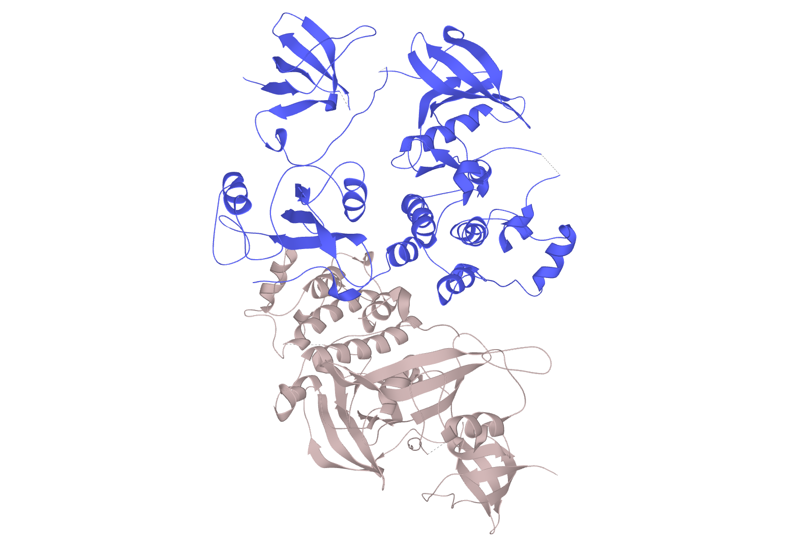

# Activity on Kinases  

## Src Tyrosine Kinase  

### Function  
Src is a signaling protein that is involved in the control of cellular growth.
It passes on these messages by adding phosphate groups to other proteins, thus turning them on.  

### Redundancy  
While there is probably only one Src itself, there are other proteins with very similar function.
Example of those would be Hck and Abl.  

### v-Src vs c-Src  
v-Src is a protein that is very similar to Src that is injected into a body by Rous sarcoma virus.
c-Src in contrast is the normal, cellular Src protein. v-Src, unlike c-Src, is continuously active
and keeps adding phosphate groups to the proteins involved in cellular growth.
This constant growth leads to tumor.  

### Drug Design Studies  
Drug studies seem to be focused on restoring normal limits on growth, so normalizing kinase function.  

### Article Abl  
Structural basis for the autoinhibition of c-Abl tyrosine kinase  

## UniProt  
- Searching for "Src" and filtering for "protein family" aswell as "reviewed" and "human",
  gives us 13 entries. 10 kinases and three coactivators.  
- Uniref100 and Uniref90 stands for sequence identity. Meaning how similar the entries are in their sequence with the Src protein family. All 13 results show a 100% identity and therefore also 90%.  
- Running the alignment (without the coactivators as they aren't kinases) doesn't allow annotation of "motif" anymore.
  Instead we select some different motifs from the list. Looking over the whole alignment shows,
  that overall the protein sequences are rather similar (conserved).
  The three motifs we chose to look at, the nucleotide binding site, the active site and
  the binding site seem especially highly conserved (marked mostly with asterisk).  
- As mentioned above, the active site residue is highly conserved. On all ten sequences,
  it is a "D", so an asparagine. There isn't much variation right next to the binding site, but a couple AAs in each direction there are differences.  
- Using the feature viewer to analyse the variants of all ten kinases, it seems that while large scale studies find some,
  UniProt and ClinVar reviewed variants aren't in the active site. Those found are missense variants with very small MAF values.  
- We chose the protein Hck (tyrosine kinase Hck P08631). We chose the structure 1AD5, as it seems to have the highest coverage (79-526).
  PDB tells us that it's coverage is 83%. No red dots visible.  

