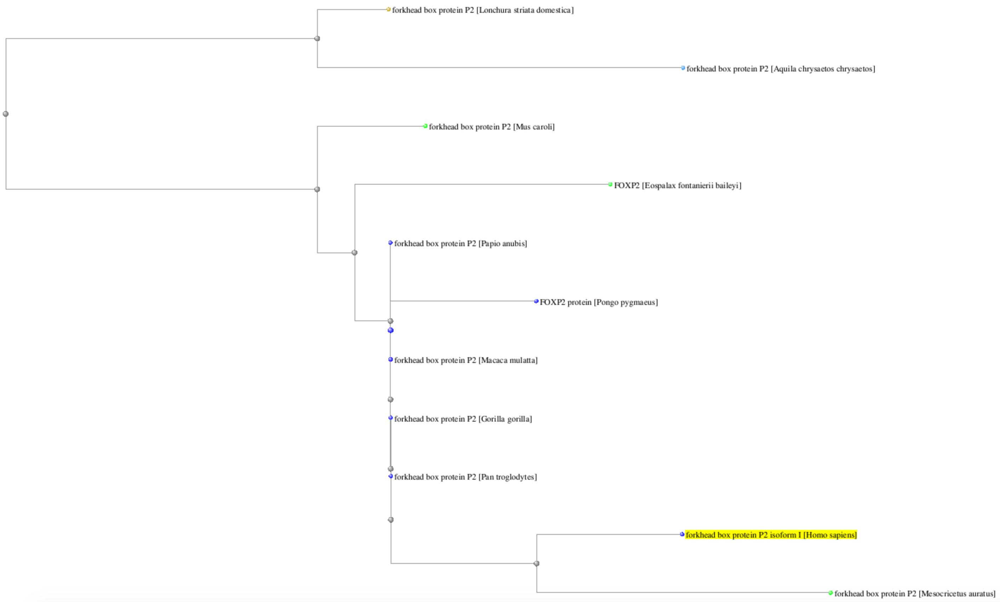
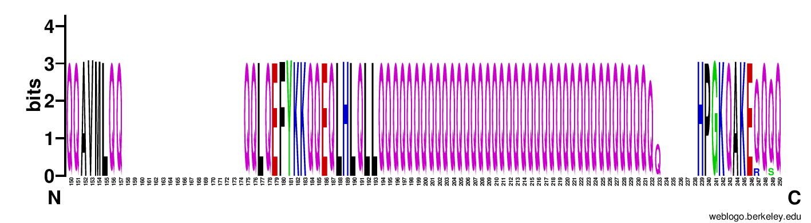

# Activity Foxp2

## 1. UniProt 

Foxp2 (O15409) is involved in a number of biological processes. Here the GO list from UniProt:  

- camera-type eye development  
- caudate nucleus development  
- cerebellum development  
- cerebral cortex development  
- innate vocalization behavior  
- lung alveolus development  
- negative regulation of transcription, DNA-templated  
- positive regulation of epithelial cell proliferation involved in lung morphogenesis  
- positive regulation of mesenchymal cell proliferation  
- post-embryonic development  
- putamen development  
- response to testosterone  
- righting reflex   
- skeletal muscle tissue development  
- smooth muscle tissue development  
- vocal learning  

Its molecular functions are mostly about DNA and metal binding activity.  

## 2. NCBI RefSeq Human  

- RefSeq stands for "Reference Sequence Database", and it is a comprehensive collection
of reference sequences.  
- The RefSeq accession number for forkhead box protein P2 isofrom 1 is NP_055306.1.  
- This is the FASTA sequence:
>NP_055306.1 forkhead box protein P2 isoform I [Homo sapiens]
MMQESATETISNSSMNQNGMSTLSSQLDAGSRDGRSSGDTSSEVSTVELLHLQQQQALQAARQLLLQQQT
SGLKSPKSSDKQRPLQVPVSVAMMTPQVITPQQMQQILQQQVLSPQQLQALLQQQQAVMLQQQQLQEFYK
KQQEQLHLQLLQQQQQQQQQQQQQQQQQQQQQQQQQQQQQQQQQQQQQQQQHPGKQAKEQQQQQQQQQQL
AAQQLVFQQQLLQMQQLQQQQHLLSLQRQGLISIPPGQAALPVQSLPQAGLSPAEIQQLWKEVTGVHSME
DNGIKHGGLDLTTNNSSSTTSSNTSKASPPITHHSIVNGQSSVLSARRDSSSHEETGASHTLYGHGVCKW
PGCESICEDFGQFLKHLNNEHALDDRSTAQCRVQMQVVQQLEIQLSKERERLQAMMTHLHMRPSEPKPSP
KPLNLVSSVTMSKNMLETSPQSLPQTPTTPTAPVTPITQGPSVITPASVPNVGAIRRRHSDKYNIPMSSE
IAPNYEFYKNADVRPPFTYATLIRQAIMESSDRQLTLNEIYSWFTRTFAYFRRNAATWKNAVRHNLSLHK
CFVRVENVKGAVWTVDEVEYQKRRSQKITGSPTLVKNIPTSLGYGAALNASLQAALAESSLPLLSNPGLI
NNASSGLLQAVHEDLNGSLDHIDSNGNSSPGCSPQPHIHSIHVKEEPVIAEDEDCPMSLVTTANHSPELE
DDREIEEEPLSEDLE

## 3. NCBI RefSeq Chimpanzee  

- The RefSeq accession number for the foxP2 protein of Pan troglodytes is NP_001009020.1.  
- This is the FASTA sequence:
>NP_001009020.1 forkhead box protein P2 [Pan troglodytes]
MMQESATETISNSSMNQNGMSTLSSQLDAGSRDGRSSGDTSSEVSTVELLHLQQQQALQAARQLLLQQQT
SGLKSPKSSDKQRPLQVPVSVAMMTPQVITPQQMQQILQQQVLSPQQLQALLQQQQAVMLQQQQLQEFYK
KQQEQLHLQLLQQQQQQQQQQQQQQQQQQQQQQQQQQQQQQQQQQQQQQQQQHPGKQAKEQQQQQQQQQQ
LAAQQLVFQQQLLQMQQLQQQQHLLSLQRQGLISIPPGQAALPVQSLPQAGLSPAEIQQLWKEVTGVHSM
EDNGIKHGGLDLTTNNSSSTTSSTTSKASPPITHHSIVNGQSSVLNARRDSSSHEETGASHTLYGHGVCK
WPGCESICEDFGQFLKHLNNEHALDDRSTAQCRVQMQVVQQLEIQLSKERERLQAMMTHLHMRPSEPKPS
PKPLNLVSSVTMSKNMLETSPQSLPQTPTTPTAPVTPITQGPSVITPASVPNVGAIRRRHSDKYNIPMSS
EIAPNYEFYKNADVRPPFTYATLIRQAIMESSDRQLTLNEIYSWFTRTFAYFRRNAATWKNAVRHNLSLH
KCFVRVENVKGAVWTVDEVEYQKRRSQKITGSPTLVKNIPTSLGYGAALNASLQAALAESSLPLLSNPGL
INNASSGLLQAVHEDLNGSLDHIDSNGNSSPGCSPQPHIHSIHVKEEPVIAEDEDCPMSLVTTANHSPEL
EDDREIEEEPLSEDLE

## 4. BLAST  

Aligning the sequences of the human foxP2 protein isoform 1 and the
foxP2 of Pan troglodytes gives the following results:  
Max score: 1431  
Length of alignment: 715  
Query Coverage: 100%  
Percent identity: 99.58%  
Percent positives: 99% (714/716)  
Gaps: 0% (1)  
e-value: 0.0  

## 5. Dot Matrix  

Sadly impossible to do, due to changes in the NCBI BLAST interface.

## 6. Cell location  

According to UniProt, foxP2 is located in the nucleus. It is involved in
speech language disorder 1 (SPCH1). It causes severe orofacial dyspraxia resulting in
incomprehensible speech. The natural variant is a non-synonymous mutation that exchanges
arginine for histidine (locus: 553).  

## 7. foxP2 Cat  

NCBI Reference Sequence: NP_001106648.1  

This is the FASTA sequence:
>NP_001106648.1 forkhead box protein P2 [Felis catus]
MMQESATETISNSSMNQNGMSTLSSQLDAGSRDGRSSGDTSSEVSTVELLHLQQQQALQAARQLLLQQQT
SGLKSPKSSDKQRPLQVPVSVAMMTPQVITPQQMQQILQQQVLSPQQLQALLQQQQAVMLQQQQLQEFYK
KQQEQLHLQLLQQQQQQQQQQQQQQQQQQQQQQQQQQQQPPPPPPHPGKQAKEQQQQQQQQLAAQQLVFQ
QQLLQMQQLQQQQHLLSLQRQGLISIPPGQAALPVQSLPQAGLSPAEIQQLWKEVTGVHSMEDNGIKHGG
LDLTTNNSSSTTSSTTSKASPPITHHSIVNGQSSVLSARRDSSSHEETGASHTLYGHGVCKWPGCESICE
DFGQFLKHLNNEHALDDRSTAQCRVQMQVVQQLEIQLSKERERLQAMMTHLHMRPSEPKPSPKPLNLVSS
VTMSKNMLETSPQSLPQTPTTPTAPVTPITQGPSVITPASVPNVGAIRRRHSDKYNIPMSSEIAPNYEFY
KNADVRPPFTYATLIRQAIMESSDRQLTLNEIYSWFTRTFAYFRRNAATWKNAVRHNLSLHKCFVRVENV
KGAVWTVDEVEYQKRRSQKITGSPTLVKNIPTSLGYGAALNASLQAALAESSLPLLSNPGLINNASSGLL
QAVHEDLNGSLDHIDSNGNSSPGCSPQPHIHSIHVKEEPVIAEDEDCPMSLVTTANHSPELEDDREIEEE
PLSEDLE

## 8. BLAST Cat  

The "gap open" and "gap extension" penalties are part of the criteria used to score an alignment. They are different, because evolutionarily it is more difficult to open up a gap
compared to extending one (so "gap open" is a higher negative score).  

Looking at results for Homo Sapiens alignment with foxP2 of Cat.  
### a)  

Max score: 1396  
Length of alignment: 707  
Query Coverage: 100%  
Percent identity: 97.90%  
Percent positives: 97% (700/715)  
Gaps: 1% (8/715)  
e-value: 0.0  

### b)  

Max score: 1379  
Length of alignment: 707  
Query Coverage: 100%  
Percent identity: 97.90%  
Percent positives: 97% (700/715)  
Gaps: 1% (8/715)  
e-value: 0.0  

### c)  

Max score: 948  
Length of alignment: 707  
Query Coverage: 100%  
Percent identity: 94.55%  
Percent positives: 94% (677/715)  
Gaps: 1% (8/715)  
e-value: 0.0  

## 9. BLAST Default  

Perhaps this has changed since the exercise was written, but the standard values
BLAST uses are 11 and 1 as seen above under a).  

## 10. Different Organisms  

Blast of human foxP2 protein. Matching sequences from:  

Organisms:  
- Pan troglodytes NP_001009020.1
- Macaca mulatta NP_001028193.1
- Gorilla Gorilla NP_001266466.1
- Pongo pygmaeus AAN60059.1
- Papio anubis NP_001162393.1
- Eospalax fontanierii baileyi AFN11569.1
- Mus caroli XP_021019982.1
- Lonchura striata domestica XP_021400917.1
- Mesocricetus auratus XP_021089156.1
- Aquila chrysaetos chrysaetos XP_029871219.1

 

## 12. Humanized Foxp2 accelerates learning by enhancing transitions from declarative to procedural performance  

For their paper Christiane Schreiweis et al. created mouse lines with human foxp2 alles. 
Those differ by wt alleles by to amino acid substitudes which are highly conserved in humans. 
FOXP2 is the sole gene to date firmly linked to speech and language development.
They find that humanized Foxp2 mice has an effect on behavioral learning dynamics as well as on striatal dopamine levels, gene expression levels, and synaptic plasticity.
Humanized Foxp2 differentially influences the functional contributions of the associative and sensorimotor striatum to learning dynamics compared with the wt. 
Foxp2hum/hum mice exhibited an altered interaction between the declarative and procedural learning strategies, favoring the procedural system when both learning systems were engaged as indicated by their more rapid transition toward procedural behavior in contrast to the wt. 
The relation between declarative and procedural learning strategies and language learning is itself unclear. A Hypothesis raised by the authors is that efficient proceduralization might accelerate probabilistic learning of language features by chunking single speech and language related actions into sequences, a feature potentially contributing to adapting the human brain for speech and language acquisition.

