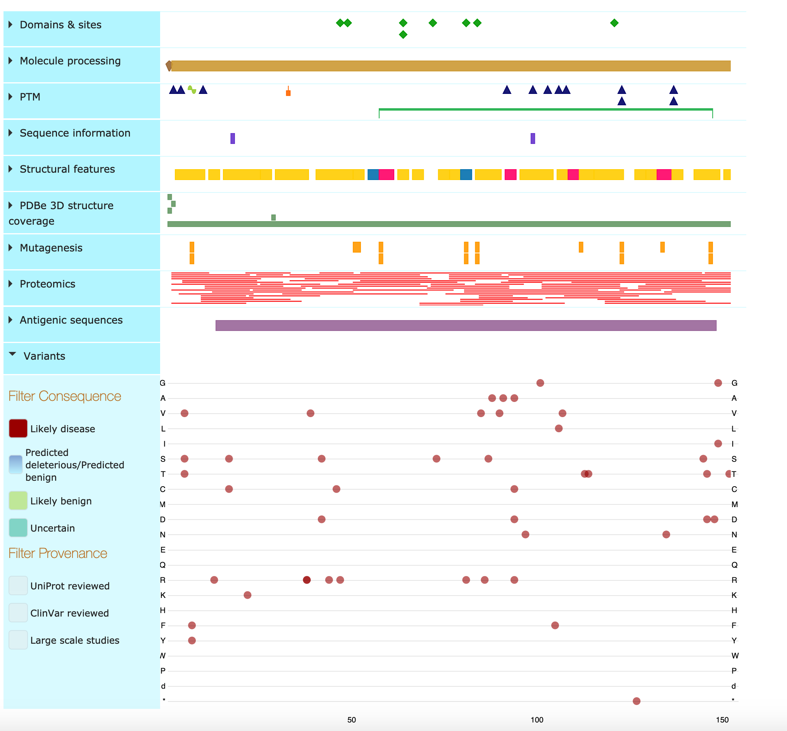
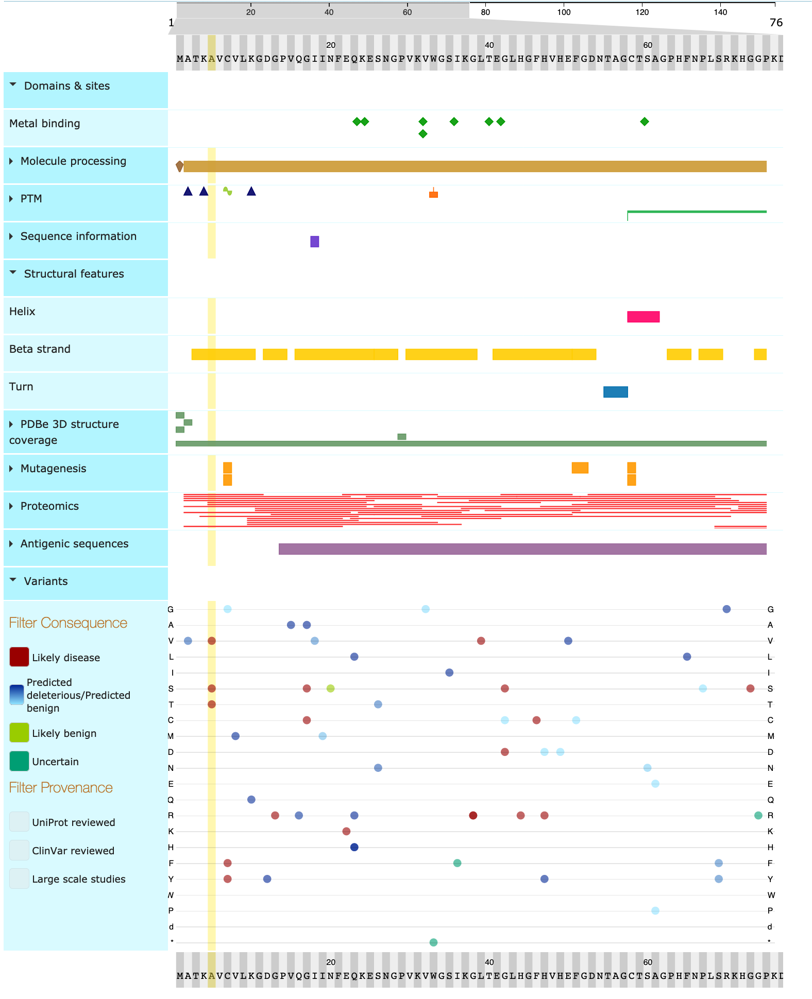

# Activity 3

## Variants in a Gene

The gene of interest is SOD1 (for hSod1 protein).
Searching for this in the EVA identifies 13 variants from 5 studies for GRCh38.p3.
In GRCh37, we find 324 variants from 33 studies.

Looking at the variant table on Ensembl reveals that SOD1 has scroll-wheel breaking amounts of variants (more than 1000).
When filtering for pathogenicity, we find 10 variants are likely pathogenic and 145 are definitely pathogenic. None of those reach allele frequencies (MAF) above 0.001.

In total, there are 248 variants with a phenotype annotation of which 195 are held privately at the human mutation gene database. All the associations publicly available pertain to ALS.

Looking at the UniProt feature viewer for hSod1 protein, reveals a number of likely pathogenic variants.

## Search for a Variant (wasn't part of activity, but we did it anyway)

Searching in Ensembl
dbSNP:rs121912442

rs121912442 has two alleles (C/T) where C is the reference. It's a missense variant in SOD1. It's associated with ALS (phenotype data) and it's very rare and equally distributed in all human populations (population genetics).

The GWAS catalogue doesn't seem to contain any information about the rs121912442 SNP.

In UniProt using the identifier rs121912442, we find one associated protein: hSod1.
The variant associated with the above SNP is VAR_007131 and causes a change from Alanine to Valine at position 5. These are both uncharged, hydrophobic aliphatic amino acids.

Looking at the feature viewer at position 5 reveals that this variant doesn't occur in an important metal binding site, but does occur in a beta strand.

