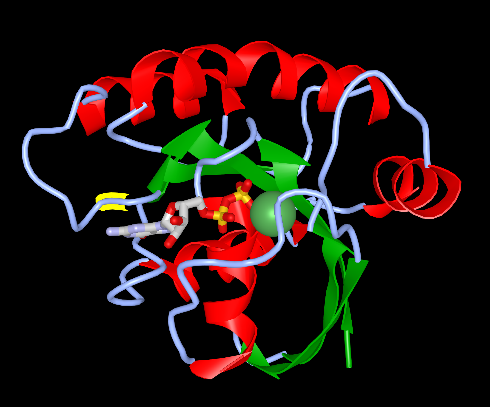

## Activity 5 - NCBI 

##### Paloma Toedtli and Bastien Canonica

**Which chromosome is it located on? Note its location.**

Chr 11 (NC_000011.10):531,909 - 535,900

**What information is contained in dbVar?**

dbVar stores informations about specific large variants, such as copy number variations, insertions, or inversions, identified in a chromosomal region of an organism. It specifies the region size, and displays the genome view, allowing to see overlapping variant regions from other studies.

**What information is in dbSNP?**

Unlike dbVar, dbSNP provides informations about short genetic variations, such as SNVs, indels, or short repeats. 

**What information is in ClinVar?**

ClinVar reports relationships between human variations and their phenotypes.

The results are filtered by selecting :
- In ClinVar – yes
- Most severe clinical significance – pathogenic
- Molecular consequence – missense variant

**How many variants do you have? (Preferably more than 3)**

There are 13 variants, summurized in the table below. In "Mutation type", (H) is hydrophobic, (P) is polar, (A) is acid and (B) is basic. 
In the "Prediction impact" (D.) means damaging.

| Variant ID       |   Mutation                       | Mutation type           |   PDB ID       |              Location in protein         | Polyphen 2 score         | Prediction impact | 
| :---             |    :----:                        |     :---:               |    :---:       |                     :---:                |      :---:               |              ---: |
| rs104894231      | Ala146Pro  Ala146Thr             | H > H H > P          | - |    In a Turn Close to GTP-binding site          |      1.000 0.935      | Probably D. Possibly D. |
| rs104894227      | Lys117Arg  Ser11Gly              | B > B P > H          | 2QUZ -    |    In a loop In the GTP-binding site            |      0.998 Error      | Probably D.  Error |
| rs121917756      | Glu63Lys                         | A > B                   | -    |    In a Beta Strand                                |      0.983.              | Probably D. |
| rs121913233      | Gln61Leu Gln61Arg Gln61Pro | P > H P > B P > H | 4G3X - -    |    In a Beta Strand                                | 0.552 0.008 0.021  | Possibly D. Benign Benign   |
| rs28933406       | Gln61Glu Gln61Lys             | P > A P > B          | -    |    In a Beta Strand                                |      0.268 0.012      | Benign Benign     |
| rs730880460      | Gly60Val Gly60Asp             | H > H H > A          | -    |    In a Beta Strand                                |      1.000 1.000      | Probably D. Probably D.    |
| rs121917758      | Thr58Ile                         | P > H                   | -    |    In a Beta Strand                                |      1.000               | Probably D.    |
| rs121917757      | Gln22Ter Gln22Lys             | P > - P > B          | -    |    In an alpha Helix                               |      - 1.000          | - Probably D.|
| rs104894226      | Gly13Val Gly13Ala Gly13Asp | H > H H > H H > A | - - 6E6P    |    In a Beta Strand  In the GTP-binding site   |  0.996 0.850 0.286 |   Probably D. Possibly D. Benign   |
| rs104894228      | Gly13Cys Gly13Arg Gly13Ser | H > H H > B H > P | -    |    In a Beta Strand  In the GTP-binding site    |  0.504 0.997 0.819 |   Possibly D. Probably D. Possibly D.    |
| rs727503094      | Gly12Ala Gly12Asp Gly12Val Gly12Glu | H > H H > A H > H H > A     | -    |    In a Beta Strand  In the GTP-binding site|  0.860 0.513 0.738 0.994 |   Possibly D. Possibly D. Possibly D. Probably D.   |
| rs104894230      | Gly12Val Gly12Ala Gly12Asp | H > H H > H H > A | -    |    In a Beta Strand  In the GTP-binding site    |  0.738 0.860 0.513 |  Possibly D. Possibly D. Possibly D.   |
| rs104894229      | Gly12Cys Gly12Arg Gly12Ser | H > H H > B H > P | 4L9S - - |    In a Beta Strand  In the GTP-binding site    |  0.525 0.878 0.831 |   Possibly D. Possibly D. Possibly D.  |

**What is the PDB ID of the wild type protein?**
In UniProt, the PDB ID of some structure is given. The structure 121P has been taken.

Using iCn3D, the structure figure of the mutated protein Hras K117R was made, and the mutation was highlighted in yellow

