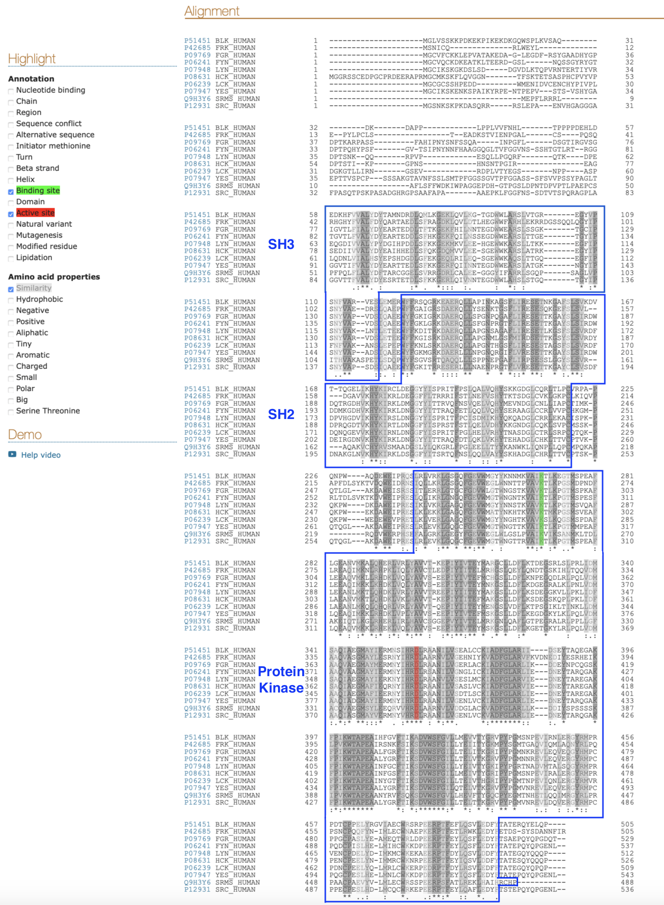
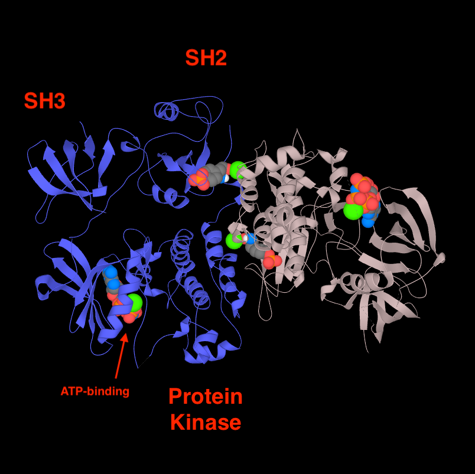

# Activity 4 - Uniprot

## Activity on kinases

### General properties - PDB

**What is the function of Src tyrosine kinases?**

Src tyrosine kinase is a signalling protein involved in cellular growth control, localised in the cell membrane. As a tyrosine kinase, it controls the activation of a wide variety of proteins by adding a phosphate group to a specific tyrosine in an amino acids chain of proteins that control cellular structure, cell communication, and cellular growth. This addition turns the proteins "on", leading them to perform their task.

**Is there only one Src tyrosine kinase? What are some others?**

Researches highlighted hundreds of tyrosine kinases, several of which are nearly identical to Src. Among the proteins similar to Src, one can find the Hck protein and the Abl protein.

**What is special about v-Src? How does it differ from c-Src?**

The Rous sarcoma virus, causing tumors in chickens, releases the v-Src protein, a protein similar to the cellular c-Src protein. In contrast to the cellular Src, v-Src is always active, causing the constant activation of proteins involved in cellular growth. 

**What is the purpose of most drug design studies against Src?**

Cancers can be caused by a mutation in the normal form of Src and other similar proteins, such as Abl, which changes them to be continually active. Drugs are designed to block the action of mutated tyrosine kinase, restoring the normal limits on growth. For example, the drug Gleevec is an effective treatment of cancers involving mutated Abl proteins.

**What is the name of the PUBMED article?**
The primary citation present in the literature section on the PDB page of AbI tyrosine kinase (1opl) is : *Structural basis for the autoinhibition of c-Abl tyrosine kinase.*

### More about Src Kinase family - UniProt

Since SRC can describe Steroid Receptor Coactivator, the data must be filtered out to show only Src kinase proteins. In search terms, filter "src" as protein family and filter "kinase" as protein family

**How many human Src kinases?**

There are 10 human kinases of the sub-family Src. 

**How many Uniref100, Uniref90? What are these?**

UniRef100 combines identical sequences and sub-fragments with 11 or more residues from any organism into a single UniRef entry.

There are 10 clusters.

UniRef90 is built by clustering UniRef100 sequences such that each cluster is composed of sequences that have at least 90% sequence identity to, and 80% overlap with, the longest sequence.

There are also 10 clusters.

### Alignment of all human Src kinases

**Can you identify any residues/regions that are highly conserved?**

As shown in the figure, the similarities can be highlighted. The symbols under the alignment show the conservation of the sequences, where (.) is semi-conservative, (:) is conservative and (*) is conserved. According to the UniProt page of the sequences, the different protein domains can be defined. The alignment shows that the three domains are quite conserved but the protein kinase domain is highly conserved in the sequences.

**How conserved is the active site residue (how can you find it)? What is it?**

The active site can be highlighted (here in red) on the alignment, but it can also be found using UniProt, in the Function section. The active site is a D (aspartic acid) and is highly conserved.

**Are there any variants around the active site residue? Use Feature Viewer to examine the sequence.**

According to the feature view of the sequences on UniProt, there are only a few natural variants around the active site of the proteins. More, all the variants around the active site are predicted deleterious/benign.

### UniProt visualisation of a Src kinase

For this exercise, HCK kinase has been chosen. The PDB ID with the maximum coverage (79-526) corresponds to 1AD5. The structure shown in UniProt is a homodimer of two kinases. In order to have a view similar to that in the Abl kinase paper, only should be shown.

The red dots shown in the paper corresponds to the ligand, the ATP. In the figure, the same ligand can be identified within the protein kinase domain.

 
