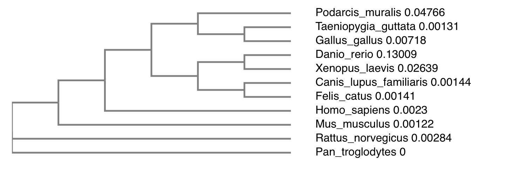

# Foxp2 Lab

##### Paloma Toedtli and Bastien Canonica

## UniProt - O15409 (FOXP2_HUMAN)

### Function and biological processes 

Forehead box protein P2 is a transcriptional repressor that may play a role in the specification and differentiation of lung epithelium, as well as in development of many tissues. It is involved in the following processes :

- camera-type eye development
- caudate nucleus development
- cerebellum development
- cerebral cortex development
- innate vocalization behavior
- lung alveolus development
- negative regulation of transcription, DNA-templated
- positive regulation of epithelial cell proliferation involved in lung morphogenesis
- positive regulation of mesenchymal cell proliferation
- post-embryonic development
- putamen development
- response to testosterone
- righting reflex
- skeletal muscle tissue development
- smooth muscle tissue development
- vocal learning

RefSeq is a comprehensive, integrated, non-redundant, well-annotated set of reference sequences including genomic, transcript, and protein.

The accession number of the transcript of human foxp2 is NM_014491.4, and the protein accession number is NP_055306.1. The sequence of the protein is downloaded in FASTA format to be used in Blastp.

The Pan troglodytes foxp2 accession number is NM_001009020.3, and the protein accession number is NP_001009020.1. The sequence of the protein is downloaded in FASTA format to be used in Blastp.

## Alignment of human foxp2 vs chimpanzee (Pan troglodyte) foxp2 : 

Max Score  1431

Length 716

Query cover 100%

Per. Ident 99.58%

Percent positive 99%

Percent gap 0%

E-value 0.0

The dot matrix is linear because they are >99% identical.

**Where is Foxp2 located in the cell?**

As it is a transcription factor it seems legit to find this protein in the nucleus.

**Which diseases is it involved in?**

It is involved in the Speech-language disorder 1 (SPCH1) caused by a SNV (R553H)

The accession number of the cat foxp2 protein is NP_001106648.1, and the accession number of the cat foxp2 transcript is NM_001113177.1

## Alignment of human foxp2 vs cat (felis catus) foxp2 

### Gap penalties : 11, 1

Max Score : 1396

Length : 715

Query cover : 100%

Per. Ident : 97.9%

Percent positive : 97%

Percent gap : 1%

E-value : 0.0

### Gap penalties : 8, 2

Max Score : 1379

### Gap penalties : 7, 2

Max Score : 948

## Foxp2 in 10 different organisms

The accession numbers of each organism is listed below 
- homo sapiens : NP_055306.1
- pan troglodytes : NP_001009020.1
- felis catus : NP_001106648.1
- podarcis muralis : XP_028602202.1
- gallus gallus : AER14044.1
- canis lupus familiaris : XP_022283307.1
- Mus musculus : NP_444472.2 
- Danio rerio : NP_001025253.1
- Rattus norvegicus : NP_001258033.1
- Xenopus leavis : NP_001089138.1
- Taeniopygia guttata : NP_001041728.1

**Phylogenic tree**

**Logo plot of DNA-Binding site and Zinc finger**

