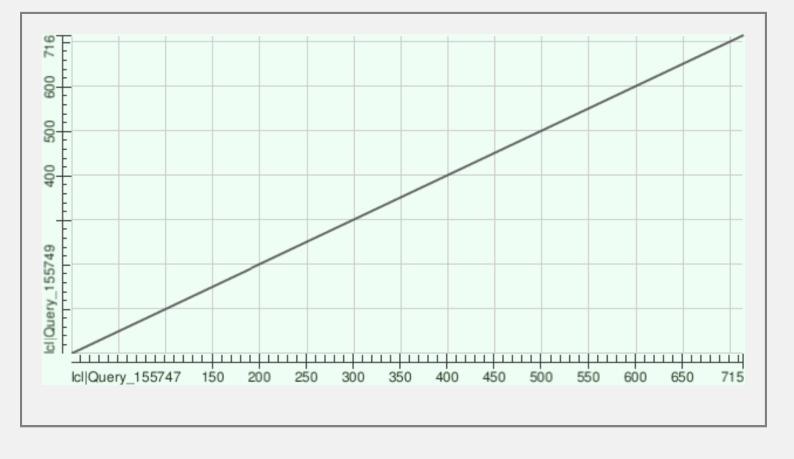
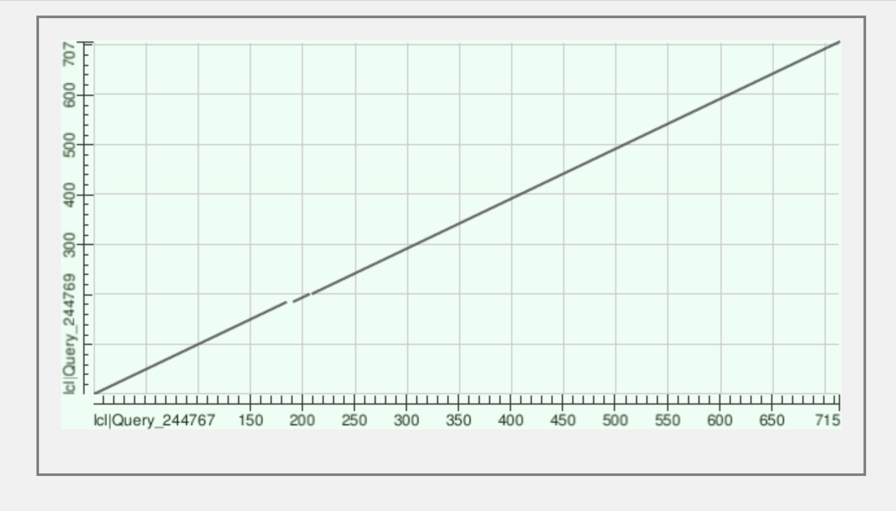
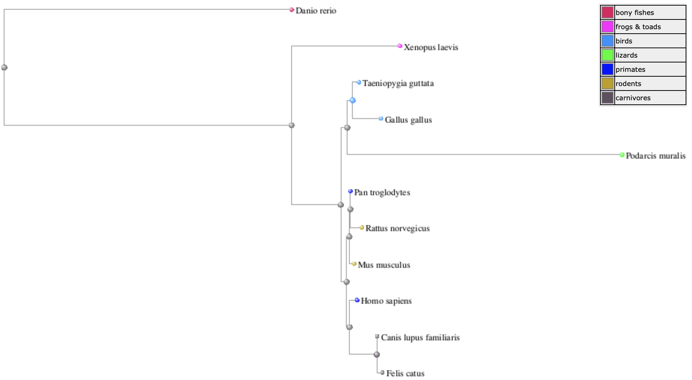
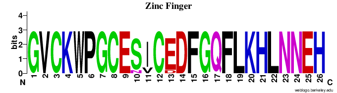

# Foxp2 Lab

##### Paloma Toedtli and Bastien Canonica

## UniProt - O15409 (FOXP2_HUMAN)

### Function and biological processes 

Forehead box protein P2 is a transcriptional repressor that may play a role in the specification and differentiation of lung epithelium, as well as in development of many tissues. It is involved in the following processes :

- Camera-type eye development
- Caudate nucleus development
- Cerebellum development
- Cerebral cortex development
- Innate vocalization behavior
- Lung alveolus development
- Negative regulation of transcription, DNA-templated
- Positive regulation of epithelial cell proliferation involved in lung morphogenesis
- Positive regulation of mesenchymal cell proliferation
- Post-embryonic development
- Putamen development
- Response to testosterone
- Righting reflex
- Skeletal muscle tissue development
- Smooth muscle tissue development
- Vocal learning

RefSeq is a comprehensive, integrated, non-redundant, well-annotated set of reference sequences including genomic, transcript, and protein.

The accession number of the transcript of **Human** foxp2 is NM_014491.4, and its protein accession number is NP_055306.1. The sequence of the protein is downloaded in FASTA format to be used in Blastp.

The accession number of the transcript of **Pan Troglodyte** foxp2 is NM_001009020.3, and its protein accession number is NP_001009020.1. The sequence of the protein is downloaded in FASTA format to be used in Blastp.

## Alignment of human foxp2 vs chimpanzee (Pan Troglodyte) foxp2 : 

Max Score : 1431

Length : 716

Query cover : 100%

Per. Ident : 99.58%

Percent positive : 99%

Percent gap : 0%

E-value : 0.0

The dot matrix showed below is almost perfectly linear because they are >99% identical. Abcissa = Human Foxp2, ordinate = Pan Troglodyte Foxp2

**Where is Foxp2 located in the cell?**

As Foxp2 is a transcription factor, this protein is found in the nucleus.

**Which diseases is it involved in?**

It is involved in the Speech-language disorder 1 (SPCH1), an autosomal dominant speech and language disorder with orofacial dyspraxia, caused by a SNV mutation (R553H).

The accession number of the **Felis Catus** (cat) foxp2 protein is NP_001106648.1, and the accession number of its transcript is NM_001113177.1. The protein sequence is downloaded in FASTA format.

## Alignment of human Foxp2 vs cat (Felis Catus) Foxp2 using different gap penalties 

Gap penalties describe the severity of gaps in a sequence alignment. By default, the gap opening penalty is setted at 11, because it is highly expensive to open a gap. The gap extension penalty is setted at 1, because once the gap is open, it costs less to expend the gap.

### Gap penalties : 11, 1

Max Score : 1396

Length : 715

Query cover : 100%

Per. Ident : 97.9%

Percent positive : 97%

Percent gap : 1%

E-value : 0.0

The dot matrix shown below is almost linear, but shows some breaks because they are 97% identical. Abcissa = Human, ordinate = Felis Catus

### Gap penalties : 8, 2

Max Score : 1379

### Gap penalties : 7, 2

Max Score : 948

## Foxp2 in 11 different organisms

The accession numbers of each organism is listed below 
- Homo sapiens : NP_055306.1
- Pan Troglodytes : NP_001009020.1
- Felis Catus : NP_001106648.1
- Podarcis Muralis : XP_028602202.1
- Gallus Gallus : AER14044.1
- Canis Lupus Familiaris : XP_022283307.1
- Mus Musculus : NP_444472.2 
- Danio Rerio : NP_001025253.1
- Rattus Norvegicus : NP_001258033.1
- Xenopus Leavis : NP_001089138.1
- Taeniopygia Guttata : NP_001041728.1

**Phylogenetic tree**

The phylogenetic tree of a protein is used to detect evolutionary relationships between homologous proteins. The phylogenic tree of the Foxp2 protein of the 11 different organisms is shown below. The sequences were first aligned using NCBI Constraint-based Multiple Alignment Tool, which constructed the tree automaticaly. 

**Logo plot of DNA-Binding site and Zinc finger**

UniProt provided the informations about the different sites locations in the proteins. Once the sites were located in each sequences, a logo plot designer tool could be used, in order to create the logo plot, describing the consensus sequence of the sites.

 

According to these plots, we can see that both sites are highly conserved among all the species.

## Arecent evolutionary change affects a regulatory element in the human FOXP2 gene

Since the discovery of a 49,000-year-old Neanderthal DNA, experiment have been conducted to compare specific genes. Substitutions between the Neanderthal and present-day human genoms have been discovered. One of this substitution affects the binding site for the POU3F2 transcription factor. Therefor, POU3F2's efficiency to bind the mutated allele has decreased. This mutation also bind less POU3F2 dimer form than the Neanderthal binding site. All those modification due to a substitution of POU3F2 binding site might be responsible for regulation changes of FOXP2 expression.

## Humanized Foxp2 accelerates learning by enhancing transitions from declarative to procedural performance.

The aim of the experiment was to determine the effect of the humanization of foxp2 (substitution of two amino acids that could have been selected positively during the evolution) on mice, and to establish a relationship between foxp2 and the ability of speech and language aquisition in human. To do so, they observed the mode of learning of mice with humanized foxp2, compared to the mice WT. They constated that the humanization of Foxp2 has an effect on behavioral learning dynamics as well as on striatal dopamine levels, gene expression levels, and synaptic plasticity. With these experiments, they are more confident about the hypothesis that humanization of this gene induces a facilitated ability to use procedural forms of learning and thus to shift more rapidly from declarative to procedural forms of learning. This shift can have been important for the appearance of language and speech in human evolution.

## One sentence to summarize Foxp2
Foxp2 is a Transcription factor, involved in brain (and other tissues) development, and highly conserved among species.

