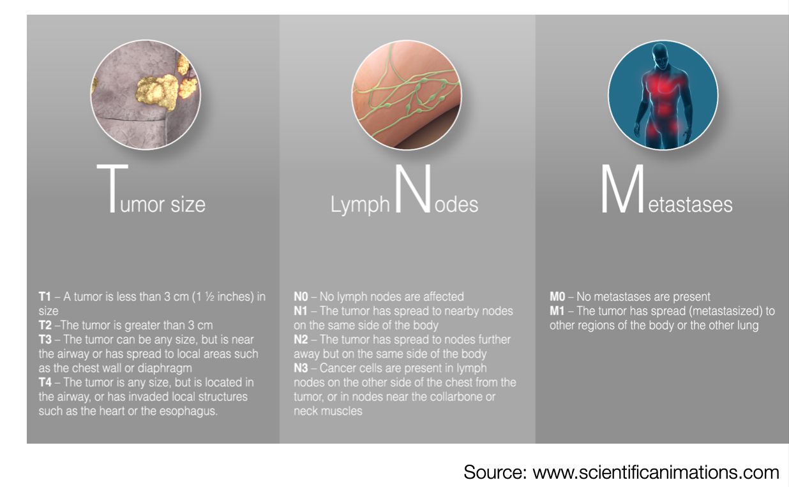
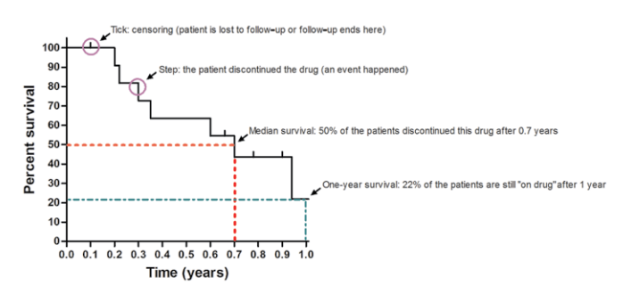

# Survival analysis - Cancer classification - Staging

## Cancer classisifaction - Staging
### ICD-O3
Stands for International Classification of Diseases for Oncology. It consits of two codes for the site (topography) and the
histology (morphology) of a neoplasm. Mostly used by pathologists and not in clinics. One disadvantage is that there is no ontology and not really hirarchical. The second code is a advantages to have the location of the tumor. 

*"Adenocarcinoma" of the "Sigmoid colon" --> 8140/3 C18.7*

### ICD-10 
Stands for 'International Statistical Classification of Diseases and Related Health Problems - 10th Revision of the Classification'. Here not only cancer types are listed but all kind of diseases subdivided in different chapters. It is mostly used in clinics and contains codes for diseases, signs and symptoms, abnormal findings, complaints, social circumstances, and external causes of injury or diseases.
*"Adenocarcinoma" of the "Sigmoid colon" --> C18.7*

### NCIt
Used for Neoplasm classifications. There is a NCI Thesaurus where all reference terminology and biomedical oncology are collected. There is only one code per cancer. It has a true ontology and is hirarchical. The assignment of code to different groupings allows soft aggregation what is a advantage.
*"Rectosigmoid Adenocarcinoma" --> NCIT:C43584*

### TNM
Is used for cancer staging. T stands forsize and extend of main tumor, N refers to the number/location of neraby lymphnodes which are inflitrated and M stands for wether the tumor metastasized. (Not used for leukemia or lymphoma) There are also other staging system which can be used for that. On the picture below the different stages can be seen. To discribe a tumor thhis annotation can be used: T1N1M0 meaning small tumor with regional lymph node involvement and no detected distant metastases.

## Survival analysis

### Kaplan-Meier

It captures the time until an event occures. It can also be used to compare two kinds of groups. Cencored: Participant leave the studie or ar excluded in the shown data. Step: The event occured. 

[Resource-Image](https://www.researchgate.net/publication/281527709_Drug_Survival_Studies_in_DermatologyPrinciples_Purposes_and_Pitfalls)
