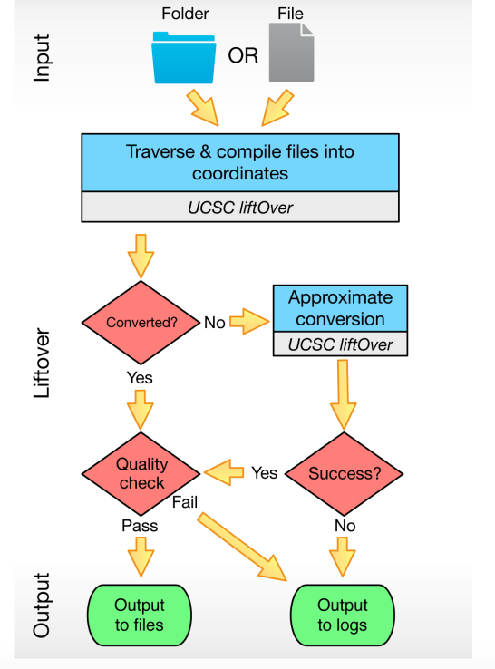
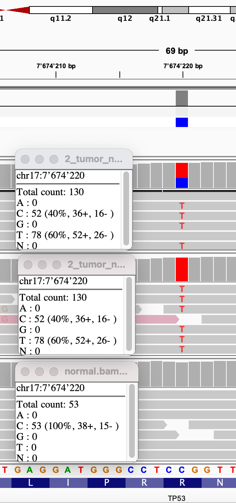

# GATK4 Mutect2 and FilterMutectCalls

## Overall Workflow

## CALL SOMATIC SNV & INDELS WITH MUTECT2
First we want to call short mutations on our HCC1143 tumor sample and matched normal using Mutect2 for that we produce three different files a BAM file with reassambled alignments, a raw unfiltered somatic callset restricted to the specified intervals list and a mutect stats file.

*Sidenote: mutect2 uses the matched normal to exclude rare germline variation, a germline population resource for evidence of alleles being germline and a panel of normals (PoN) to fill the gap between the matched normal and the population resource and also to catch additional sites of noise in sequencing data.*

Next we have to creat a PoN. Ideally, the PoN should include technically similar samples that were sequenced on the same platform. This can be done with *GATK4.beta.6.*

In this part we generated an unfiltered Mutect2 callset.

## FILTER FOR CONFIDENT SOMATIC CALLS

In this part the filtering is described to identify which mutation candidates are likely to be real somatic mutations.

For filtering we need to estimate a cross-sample contamination. This can be done with *GetPileupSummaries* and *CalculateContamination*.

With *GetPileupSummaries* the read support for a set number of known variant sites can be summarized. We use a population germline resource containing only common biallelic variants (limits analysis to sites that are commonly variant) to filter out the most common germline mutations. We do this for the tumor as well for the normal file.

Next we estimate contamination with CalculateContamination* for both samples.

The next step is the filtering usding the raw vaianr from the first part and the contamination. It produces an VCF file with the variants.

## REVIEW THE CALLS

Reviewing callset involves comparing callsets from different callers, manually reviewing passing and filtered and maybe additional filtering.

As an example we review TP53 locus at chr17:7,666,402-7,689,550, more precise chr17:7,673,333-7,675,077:
It is a C-->T mutation.

*We see a C→T variant light up in red for the tumor but not the normal. What do you think is happening in 2_tumor_normal_m2.bam?*
In this file the coverage of eighter C or T in comparison with the reference is shown. The file contains both samples aswell the tumor and the normal ones. It clearly shows that all tumor samples contain a T and all normal sampels a C. This is also made clear with the tumor.bam coverage and normal.bam coverage. This is ilustrated in the figure below. 

