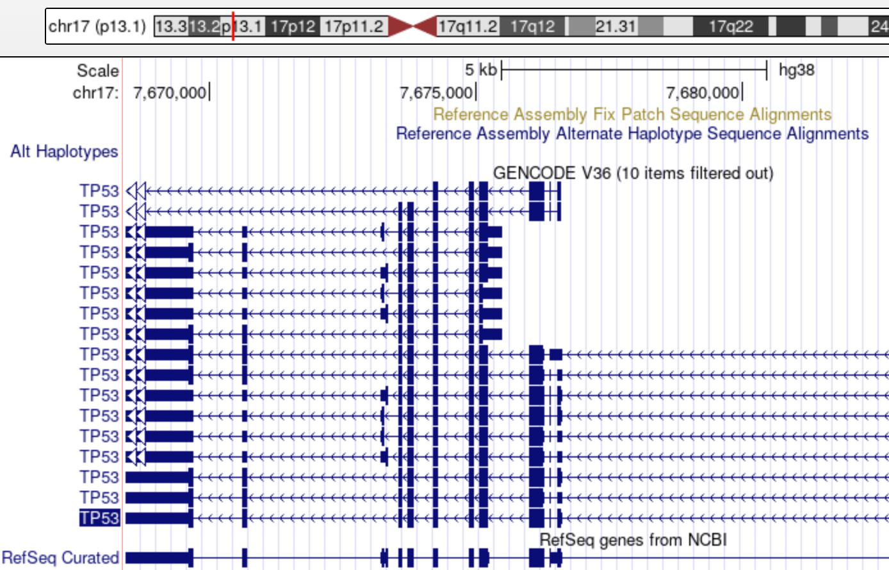

## Introduction to Genome Versions

### The name and time of the latest version for Human, Mouse and E Coli.

* Human: GRCh38.p13 - March 1, 2019
* Mouse: GRCm39 - June 24, 2020
* E Coli: ASM584v2 - September 26, 2013

### The name and time of the first version for Human, Mouse and E Coli.
* Human: NCBI34/hg16 - February 4, 2004
* Mouse: NCBI35/mm7 - August, 2005
* E Coli: ASM584v1 - June 21, 2004

### How many reference genomes were released in total for Human, Mouse, and E Coli.

* Human: 5
* Mouse: 5
* E Coli: 2

### Find out the difference in chromosome length between the latest patch of hg38 and the last patch of hg19. 
Total lenght of **hg38** patch 13: 3,099,706,404bp **hg19** patch 13: 3,101,788,170 bp

-> the older patch has more bp in the assambly.

### With your favorite gene, !nd out its position in hg38 and hg18.
* **hg38**: chr17:43,044,295-43,125,483
* **hg18**: chr17:38,449,840-38,530,994

## Introduction to the UCSC Genome Browser

### Show gene TP53 in the genome browser

### Where is this gene? (chromosome, cytoband, and exact start and end positions)
Chr 17; Cytoband p13.1 ;  positions: 7,668,421 - 7,687,490

### How many isoforms does it have?
17

### How many exons does it have?
11

### What the size of its longest exon? (roughly)
1200bp

### Find the three closest genes in upstream and downstream, respectively.
* upstream: SHBG, SAT2,ATP1B2
* downstream: WRAP53, RP11-199F11.2, EFNB3

### Switch to hg19 and find TP53

### What is the start and end positions?
7,571,720-7,590,868

### Switch to zebra!sh, can you find TP53?
Yes

### Switch to Fruit#y, can you find TP53?
No.

### Lift a larger range and interpret the result.

**hg38**: chrX	130621262	154318397	0	0.0757	45
**hg19**: chrX	129755236	153546744	0	0.0757	4

In the newer version is the start moved to a larger position due to more assembled positions upstream. In hg38 the sequence is also smaller,maybe because of sequencing errors.

### Limitations of the liftover.
--> we relized that one position always fail to convert

