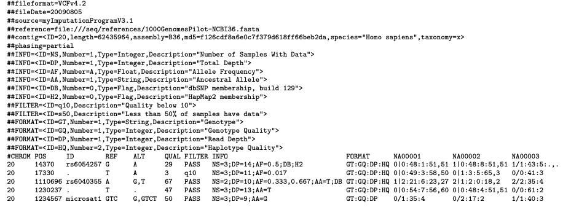

# Genome file formats
2 bits per base required, therefore a genome requires 715 MB (1 MB = 8000000 Bit)
1 PB costs 500000CHF
For the cost and storage capacities 1000 genomes are taken 

## File formats and storage capacities
*Considering WEG (Whole Genome Sequencing) and WES (Whole Exome Sequencing)*
WGE: 3 billion bp
WES: 1.5% of whole genome: 45 million bp

### [SAM](https://samtools.github.io/hts-specs/SAMv1.pdf)

It is a TAB-delimited text-based format it has a header section and an alignment section. The header starts with @. The alignment has 11 fields for information as mapping position.

* WEG: 500TB cost: 250000CHF
* WES: 7.5TB cost: 3750CHF

### BAM
Compressed binary version of a SAM file,it has to be converted first before it can be read by us humans :)

* WEG: 100TB cost: 50000CHF
* WES: 1.5TB cost: 750CHF

### [VCF](https://www.ncbi.nlm.nih.gov/pmc/articles/PMC3137218/)

It is a text file format where variants can be stored. It consists of a header and data lines. Each data line stores information about a position in the genome. It shows which chromosome, position, what the reference base is, the variation for both alleles, quality, filter, additional information and than all samples tested.

 

* WEG: 125GB cost: 62.50CHF
* WES: 1.875GB cost: 0.95CHF

### FASTA
A FASTA file is a text-based format for representing nucleotide or peptide sequences. The format begins with a single line description, this line starts with a >.

* WEG: 200GB cost: 100CHF
* WES: 3GB cost: 1.5CHF

 
## Getting familiarized with VCF format
Already done above

## Notes about lift-overs:
will follow

### Resources:

https://warwick.ac.uk/fac/sci/statistics/staff/academic-research/nichols/presentations/ohbm2014/imggen/Nho-ImgGen-WGSeqPractical.pdf

https://medium.com/precision-medicine/how-big-is-the-human-genome-e90caa3409b0

 
