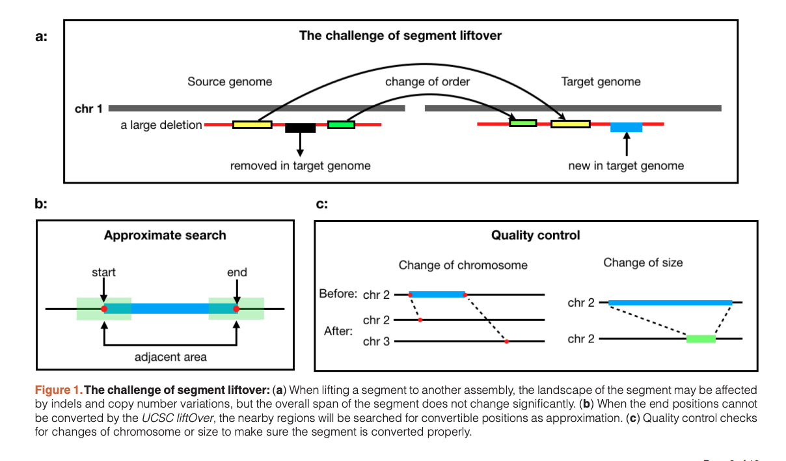
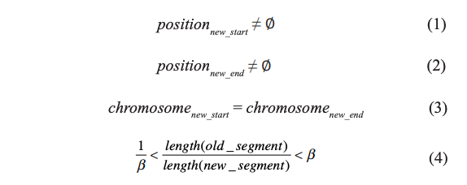

# segment_liftover: a Python tool to convert segments between genome assemblies

## Intro
Lates version of human genome still contains more than 10 million unplaced bases. When conducting an analysis it is important to convert all data into the same genomic coordinat system.

There are two methodes: 
* **re-align original data to target**: good result but time-consuming and only possible if original data exists
* **using mapping file to convert coordinates**: minimal loss of information but good enough for most things

Currently three tool aviable for conversion between genome assamblies and coordinates:

* liftOver: 
  * University California USCS
  * webservice & command line
  * most comprehensive selection of assemblies for different species
 
* CrossMap
  * Zhao
  * Convert files into BAM/SAM or BigWig
  * Same results as liftOver
  * No coverting between species

* Remap
  * NCBI
  * Comprehensive list of major assemblies
  * Cross species mapping
  * Limited species
  * Only webserver --> difficult for large scale

All give mostly the identical result. However if secuence is not continuous CrossMap and Liftover are breaking the sequence into peaces Remap maps the span to the target sequence. See Figure 1a below.

Biggest limitation of these tools is a single imput file 

## segment_liftover

* integretiy-preserving conversion
* re-conversion by locus-approximation
* numerous files

### Implementation

Can convert probe file and segment files at the same time or in different runs.

*segment_liftover* uses liftover from the USCS. If this fails it uses the approximate conversion, see Figure 1b. The criterias below need to be fullfilled for a successfull conversion. If all criteria are failing, than the segment is unconvertable. See Also Figure 1c above for clraification.

### Operation

* Python
* Aviable for OSX and Linux
* Min 2G
* For installation pip
* requires USCS *liftOver*

## Worflow

## Use Cases

* Converting arrayMap data from hg19 to hg38
* Comparison of different conversion startegies

