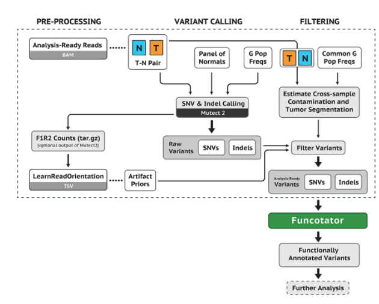

## **Somatic Short Mutation Calling using GATK4 Mutect2**

### **1.1  Call somatic SNVs and indels and generate a BAMOUT**
First, we call somatic short mutations on the HCC1143 tumor sample and matched normal using Mutect2.
Therefore we generate: 1) A raw unfiltered somatic callset restricted to the specified intervals list, 2) A BAM containing reassembled alignments and 3) A Mutect stats file.

> Mutect2 uses:
* the matched normal to additionally exclude rare germline variation not captured by the germline resource and individual-specific artifacts
* a germline population resource towards evidence of alleles being germline
* Mutect2 uses the PoN to catch additional sites of noise in sequencing data, like mapping artifacts or other somewhat random but systematic artifacts of sequencing and data processing

> PoN: A panel of normals has a vital role that fills a gap between the matched normal and the population resource.

### **1.2 Make a panel of normals (PoN)**

Out of 40 exome samples aligned to GRCh38 (BAM files) using GATK4.beta.6.

### **1.3 Filter for confident somatic calls**
Using filtering tools: identification of which mutation candidates are likely to be real somatic mutations out of the unfiltered Mutect2 callset. -> Filterin out germline mutations
Estimation of cross-sample contamination with the tools GetPileupSummaries and CalculateContamination.

Run `GetPileupSummaries` to summarize read support for a set number of known variant sites: It involves a known germline variant resource to limit analysis to sites that are commonly variant. We should use a population germline resource containing only common biallelic variants (Normal samples).

=> Comparison of normal samples and tumor samples (both including germline mutations)
 
 Estimate contamination with CalculateContamination: The resulting files from the tumor and normal samples each give the fraction contamination and the error.
 
### ** 1.4 Apply filters with FilterMutectCalls**

The tool FilterMutectCalls uses the annotations within the callset, and if provided, uses the contamination table in filtering the vcf file of somatic mutations.

### **1.5 Review calls with IGV**
Load analysis data and reference genome GRCh38 on IGV -> TP53 gene
We see a C→T variant light up in red for the tumor but not the normal. What do you think is happening in 2_tumor_normal_m2.bam?
=> The coverage in this bam file is 40% C and 60% T 
=> the file consists of tumor and normal samples, therefore the C belongs to normal samples and the T belongs to tumor samples
=> All tumor cells have a C-T transition at this position

