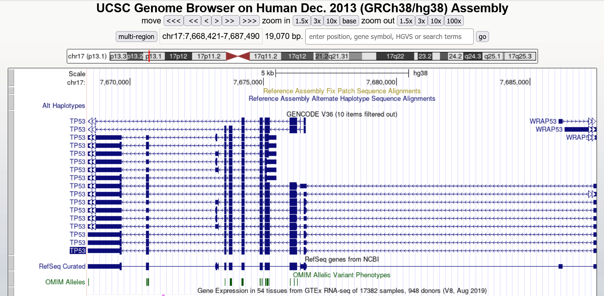

## **Introduction to Genome Versions**

### **Task 1: Reference Genome Variants**
*1. Name and time of the latest version for* 
* Human: GRCh38.p13; March 2019 
* Mouse: GRCm39; June 2020 
* E.Coli: ASM584v2; September 2013

*2. Name and time of the first version for* 
* Human: NCBI34/hg16; July 2003
* Mouse: NCBI35/mm7; August 2005
* E.Coli: ASM584v1; June 2004

*3. How many reference genomes were released in total for* 
* Human: 5
* Mouse: 5
* E Coli: 2

### **Task 2: Difference between genome versions**
*1. Find out the difference in chromosome length between the latest patch of
hg38 and the last patch of hg19.* 

hg19 patch 13 (latest): total length = 3,101,788,170 bp
hg38 patch 13 (latest): total length = 3,099,706,404 bp

=> The older patch has more total bp than the newest.

*2. With your favorite gene, find out its position in hg38 and hg18.*
=> looked for BRCA1
hg38 position: chr17:43044295-43125483
hg18 position: chr17:38449840-38530994

### **Task 3: UCSC Genome Browser**

*1. Show gene TP53 in the genome browser.*

*2. Where is this gene?* 

* Chromosome: 17
* Cytoband: p13.1
* Exact start and end positions: 7,668,402-7,675,493

*3. How many isoforms does it have?*

17

*4. How many exons does it have?*

11

*5. What the size of its longest exon? (roughly)*

~1200bp

*6. Find the three closest genes in upstream and downstream, respectively.*

Upstream: SHBG, SAT2, ATP1B2
Downstream: WRAP53, RP11-199F11.2, EFNB3

### **Task 4: UCSC Genome Browser**
*Switch to hg19 and find TP53.*

*1. What is the start and end positions?*
7,571,720-7,590,868

*2. Switch to zebrafish, can you find TP53?*
Yes

*3. Switch to Fruitfly, can you find TP53?*
No.

