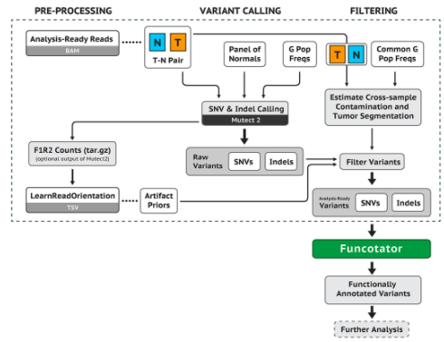

# GATK 

### General Workflow of GATK



1. Align reference sequence and Raw Sequence -> Aligned BAM -> Mark duplicates -> Realign -> Analysis Ready BAM Seq
2.  **T**, **N**, **G Pop**, **PON** -> Variant Calling -> Raw Variants
3.  **T**, **N**, **G Pop** -> Contamination
4.  Filtering (Raw Variants& Contamination) -> Functator -> **Variant**

T: tumor genome sequence  
N: matched normal; 'normal' genome sequence of same individual (from eg. blood)  
G Pop: germline frequencies from population; AF (Allele Frequency in Population)  
PON: a panel of normals;  fills a gap between the matched normal and the population resource to reduce noise.  

### 1 somatic mutect tutorial - Variant calling

> somatic short mutations calling: single nucleotide and indels. 

##### Step 1: Call somatic SNVs and indels and generate a BAMOUT
First we somatic short mutations on our HCC1143 tumor sample and matched normal using Mutect2.  
--> this produces :A raw unfiltered somatic callset restricted to the specified intervals list, A BAM containing reassembled alignments, Mutect stats file named. 

##### Step 2: Make a panel of normals (PoN)
The PoN was made using GATK4.beta.6 with 40 exome samples aligned to GRCh38.  


> Estimate cross-sample contamination to check if sequences are contaminated. 

##### Step 3: Filter for confident somatic calls: Estimate cross-sample contamination
So far we generated an unfiltered Mutect2 callset. Now, we will use filtering tools to identify which mutation candidates are likely to be real somatic mutations.  

**Run GetPileupSummaries to summarize read support for a set number of known variant sites**
The tool tabulates read counts that support REF, ALT and OTHER alleles for the sites in the resource. This involves a known germline variant resource to limit analysis to sites that are commonly variant. Use a population germline resource containing only common biallelic variant.  

We run it normal samples and tumor samples. 
Each command produces a six-column table as shown. The alt_count is the count of reads that support the ALT allele in the germline resource. The allele_frequency corresponds to that given in the germline resource. Counts for other_alt_count refer to reads that support all other alleles.

```
#<METADATA>SAMPLE=HCC1143_tumor
contig	position	ref_count	alt_count	other_alt_count	allele_frequency  
chr6	  29942512	9	        0	        0	              0.063  
chr6	  29942517	13	        1	        0	              0.062  
```

The tool considers homozygous-variant sites in the sample where the alternate allele frequency (AF) in the population resource ranges between 0.01 and 0.2. This range is adjustable. We can expect a lot of contamination by alternate alleles at sites where the alternate AF is large, so those sites wouldn't tell us much. Conversely, at homozygous-alternate sites where the variant allele is rare in the population, we are more likely to observe the presence of REF or other alleles if there was cross-sample contamination, and therefore we will be able to measure contamination more accurately.  

**Estimate contamination with CalculateContamination**  
The tool gives the fraction contamination. This estimation informs downstream filtering by FilterMutectCalls.  

```
sample	      contamination	        error
HCC1143_tumor	0.019127415053507495	0.0021541303669512504

sample	      contamination	        error
HCC1143_tumor	0.011485364960150258	0.0019180421331441303
```

For our small tumor BAM file, you can see the contamination is ~0.0191 with an error of ~0.0022. We get a slightly lower number, ~0.0120 +/– 0.00454 for the matched estimate. For the full BAM file, we see a slightly larger contamination number. This threshold informs you to be wary of calls with less than that number for the alternate allele fraction.

**Apply filters with FilterMutectCalls**  
The tool uses the annotations within the callset, and if provided, uses the contamination table in filtering.  

This produces a VCF callset 9_somatic_oncefiltered.vcf.gz and index. Calls that are likely true positives get the PASS label in the FILTER field, and calls that are likely false positives are labeled with the reason(s) for filtering in the FILTER field of the VCF. We can view the available filters in the VCF header using:  

```
##FILTER=<ID=FAIL,Description="Fail the site if all alleles fail but for different reasons.">
##FILTER=<ID=PASS,Description="Site contains at least one allele that passes filters">
##FILTER=<ID=base_qual,Description="alt median base quality">
##FILTER=<ID=clustered_events,Description="Clustered events observed in the tumor">
##FILTER=<ID=contamination,Description="contamination">
##FILTER=<ID=duplicate,Description="evidence for alt allele is overrepresented by apparent duplicates">
...  
```

This step seemingly applies 20 filters, including contamination. However, if an annotation a filter relies on is absent, the tool skips the particular filtering. The filter will still appear in the header. For example, the duplicate_evidence filter requires a nonstandard annotation that our callset omits.

##### Step4: Review calls with IGV


