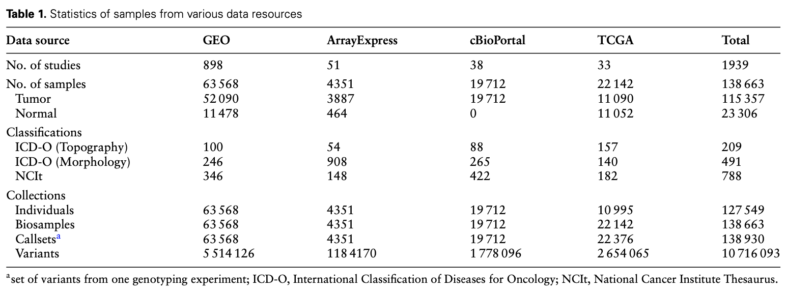
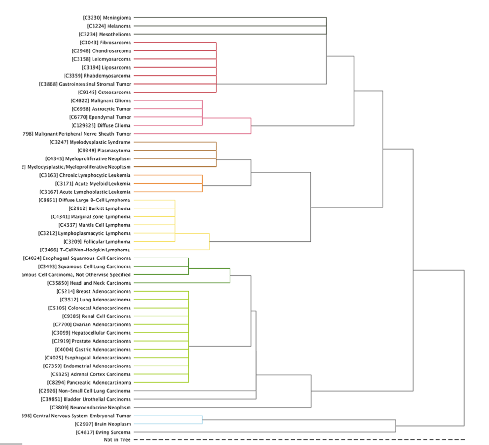
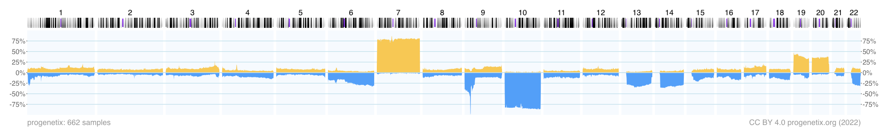

# *"The Progenetix oncogenomic resource in 2021"* - Reading Notes

* Background:
  *  CNVs: frequent type of mutation in cancer
  *  study mechanisms underlying tumorogenesis and characterize molecular subtypes requires: comparative analysis of *large* collections of genomic variants

* Description of Progenetix:
  > Progenetix is a publicly accessible cancer genome data resource (progenetix.org) that aims to provide a comprehensive representation of genomic variation profiles in cancer, through providing sample-specific CNA profiles and associated metadata as well as services related to data annotation, meta-analysis and visualization.
  > Originally established in 2001 with a focus on data from chromosomal Comparative Genomic Hybridization (CGH) studies (3), the resource has progressively incorporated data from hundreds of publications reporting on genome pro- filing experiments based on molecular cytogenetics (CGH, genomic arrays) and sequencing (whole-genome or whole- exome sequencing—WGS or WES). 
 
* Data found on Progenetix:
  > For data content, additions include the complete incorporation of the previously separate arrayMap data collection and of datasets from external resources and projects such as The Cancer Genome Atlas (TCGA) or cBioPortal, as well as the recurrent collection and re-processing of array-based data from National Center for Biotechnology Information (NCBI)’s Gene Expression Omnibus (GEO) or Euro- pean Molecular Biology Laboratory-European Bioinformatics Institute (EMBL-EBI)’s ArrayExpress.

* metadata updates:
  * ICD-O-3 is used for cancer sample classification
  * all cancer samples in Progenetix have been annotated with an NCIt code (788 distinct NCIt codes in total), which can be visualized in a hierarchical tree:

  * cancer genomes are grouped in 51 NCIt nodes
  * grouping of cancer types can be used to assess differences in the CNV landscape among the groups
  * most studied cancer type: breast carcinoma
  * Uberon anatomy ontology: cross-species anatomical structural ontology systems closely aligned with developmental processes ➡️ allows queries linking multiple databases 
  * provenance by geography: each sample contains information about its provenances in the form of geographic coordinates
  * provenance by ancestry group: possible in the case of samples where SNP data is accessible

# Questions
**1. what is CNV/CNA?**

  * **CNV** (copy number variation) is usually used to refer to *germline events*, which are variants in the population.

  * **CNA** (copy number aberration) is usually used to refer to *somatic events*, like those found in tumors.

**2. how will you describe or introduce progenetix? (scale, data source, cancer types and so on)**

Description found on the main page of the [Progenetix website](https://progenetix.org):
> The Progenetix database provides an overview of mutation data in cancer, with a focus on copy number abnormalities (CNV / CNA), for all types of human malignancies. 
> The data is based on individual sample data from currently 142063 samples.

Progenetix uses ICD-O-3 is for cancer sample classification. More specifically, cancer genomes are grouped into 51 NCIt nodes that can be visualized as a hierarchical tree. Progenetix also contains samples of cancer cell lines, as they are an important model for understainding the molecular mechanisms of cancer.

**3. what are CNV segmentations and CNV frequencies and how to use them?**

  * CNV segmentation? (couldn't find a definition...)

  * CNV frequencies: how many times a copy number variation is observed for a certain locus.

The fraction of genome with a copy number alteration (CNV fraction) varies widely among the cancer types. CNV frequencies can be used to assess differences among different cancer genomes that have been previously grouped into 51 NCIt nodes.
 
**4. what are APIs and how to use APIs in progenetix?**

**API**: **A**pplication **P**rogramming **I**nterface

An API is a way for two or more computer programs to communicate with each other.

Progenetix uses the GA4GH Beacon API for querying of genomic data.

**5. how does progenetix visualise CNA profiles?**

CNA profiles can be visualized by making a querying on this [Progenetix page](https://progenetix.org/biosamples/). An example of a result would be the following:

Results of the query also contain some basic statistics and download options.

**6. what do you think should be improved in progenetix?**

Maybe add more types of genomic variant data to the database (not only CNV data) 🤓

