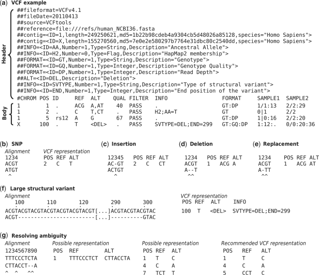

Deadline: Tue 2022-09-04

### In general...
* Human genome: 3 billion nts
* Idea: store genome information using file formats based in coordinates (chr, start, end), and _not_ sequences.
* Required: a reference genome.

Also wanted: 
* automation of genomic sequence retrieval ▶️ need of standardizing data analysis
* increase reproducibility ▶️ UNIX: efficient, scalable, portable, open

Terminology:
* variant calling = variant detection

## File Formats

📄 **FASTA**: unaligned sequences
  * text file
  * ID + sequence
  
```
>NC_009902.1 Babesia bovis T2Bo mitochondrion, complete genome
TTTAAAAAAGTGTTAAAAACTTTATACATTAAAAAATTTAAACAAGTGATCATGTATAAAGTACACTTGT
TACTGTGTAAATATCAAAAACAATTTAATTTCAAAATTTTTGAAATATGTTTTTTGTGTTGTGTTATAAA
GTTTTTTTTCAAAATTATATATGTTTGCATTTGCTGGATATAGTTCGGTCTCTGCAAACCATAAAGTCAT
CGGTATATCCTACATATGGCTTTCATATTGGTTTGGAGTTATTGGATTTTATATGAGTATTTTGATAAGA
ACAGAATTGAGTATGAGTGGTTTAAAGATTATGACAATGGATACTCTTGAGATATACAATATGATGTTTT
```

📄 **FASTQ**: unaligned sequences (:bangbang: short reads sequencing)
  * ID + sequence + separator + quality score
  * sequence quality is represented using Phred scores, which are logarithmically linked to error probabilities (of incorrect base call) (different encodings exist)
```
@SRR001666.1 071112_SLXA-EAS1_s_7:5:1:817:345 length=36
GGGTGATGGCCGCTGCCGATGGCGTCAAATCCCACC
+
IIIIIIIIIIIIIIIIIIIIIIIIIIIIII9IG9IC
```

📄 **SAM (Sequence Alignment Map)**: alignments
  * Idea: store where the reads (saved as FASTQ) map on the reference genome
  * Goal of sequence alignment: identify regions of similarity or the identity of a sequence
  * Local vs. Global aligment
  * human-readable text files
  
📄 **BAM (Binary Alignment Map)**: alignments
  * binary and compressed equivalent of SAM
  
📄 **BED (Browser Extensible Data)**: genomic ranges
  * BED3, BED6, BED12
  * tab-separated colummns: chromosome - start - end

```
chr22 1000 5000
chr22 2000 6000
```
  * coordinate specification: 
    * 0-start vs. 1-start 
    * fully-open (4001-4999), fully-closed (4000-5000), half-open (4000-4999)
    
📄 **BEDgraph**: genomic scores
  * BED3 + probability score (like a "BED4")
  
📄 **Wiggle files**: genomic scores

📄 **GFF (Genetic Feature Format) and GTF**: gene annotation

📄 **VCF (Variant Call Format)**: variants
  * Generic format for storing DNA polymorphism data such as SNPs, insertions, deletions and structural variants, together with rich annotations. 
  * Usually stored in a compressed manner and can be indexed for fast data retrieval of variants from a range of positions on the reference genome.  (Danecek et al 2011)
  * Tailored for storing information *across many samples*
  * VCF file consists of **two** main sections: (1) header section + (2) data section
  * VCF file has 8 (mandatory) columns: ```CHROM, POS, REF, ALT, QUAL, FILTER, INFO```


  

## WES & WGS 

### WES (Whole Exome Sequencing)
👉 determines exact order of nucleotides withing protein-coding regions (exomes)

💰 wide variety of prices

💾 captures 2% of human genome: ca. **6 MB** of data to store

### WGS (Whole Genome Sequencing)
👉 determines exact full nucleotide order of a DNA sequence

💰 more expensive but provides a more complete view than SNP genotyping: new discoveries can be made

💾 captures 100% of human genome: ca. **3 GB** of data to store

## 1st task: Estimate Storage Requirements for 1000 Genomes

* 2 bits/base: `00, 01, 10, 11` for `TCGA`
* 8 bits = 1 byte
* $8 \cdot 10^6$ = 8000000 = 1 MB

💾 **WGS storage**: 
* size of human genome: $3 \cdot 10^9$ bases
* required bits to encode 1 genome: $2 \cdot 3 \cdot 10^9$ = 6000000000 bits = 750 MB
* 1000 genomes $\Rightarrow$ $750 \cdot 1000$ = 750 GB

💾 **WES storage**:
* size of human exome: $3 \cdot 10^7$ bases
* required bits to encode 1 exome $2 \cdot 3 \cdot 10^7$ = 60000000 bits = 7.5 MB
* 1000 exomes $\Rightarrow$ $7.5 \cdot 1000$ = 7.5 GB

**Costs**:
* 1 PB = ca. 500'000 CHF
* 1 PB = 1'000'000 GB
* 1 GB = ca. 0.5 CHF
* 💰 **WGS** $\Rightarrow$ $750 \cdot 0.5$ = **375 CHF**
* 💰 **WES** $\Rightarrow$ $7.5 \cdot 0.5$ = **3.75 CHF**

Note: depending on the file format used to store the sequences, different costs!


## 2nd task: Reading up on Genome Technologies

Relevance for this course: one of the main uses of next-generation sequencing is to discover variation among large populations of related samples. 

### Molecular-cytogenetic techniques:
* Cytogenetics = chromosomal analysis 
* Idea: study structural changes in chromosomes w/o knowledge about sequence alterations
* **CGH (Comparative Genomic Hybridization)**:
  * identify regional genomic copy number variations (CNV/CNA)
  * based on in situ suppression hybridization of labeled genomic tumor and reference DNA
    against a karyotypically normal metaphase chromosomes
  * analysis of relative fluorescence ratio allows semi-quantitative copy number read-out
  * **indirect** attribution of involved target genes through cytogenetic bands (megabase resolution)
* **aCGH (array Comparative Genomic Hybridization)**: 
  * identify genomic copy number variations (CNV/ CNA) **for given sequences (multi-kb to Mb)**
  * based on in situ suppression hybridization of labeled genomic tumor and reference DNA against spotted or synthesized DNA clones or oligonucleotides
  * analysis of relative fluorescence ratio allows semi-quantitative copy number read-out
  * **direct** attribution of involved target genes through known sequence content
* M-FISH:
  > Multiplex in situ hybridization (M-FISH) is a 24-color karyotyping technique and is the method of choice for studying complex interchromosomal rearrangements.

### General NGS technologies
* NGS = next generation sequencing 👉 much faster than than old technologies like Sanger sequencing
* NGS steps: 1) DNA sample fragmentation, 2) library generation, 3) amplification 

* count based vs. intensity based as principle
* Nanopore Sequencer: 
  * 😄 can sequence very long reads
  * 😄 identify DNA of known composition and for de-novo assembly for telomere/repeat regions
  * 😞 fidelity not very high: not good to identify new SNPs and for disease diagnostics! 
